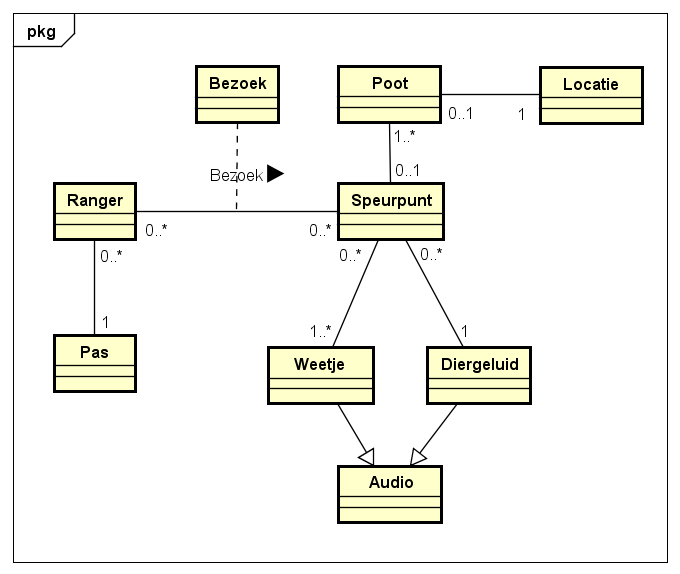
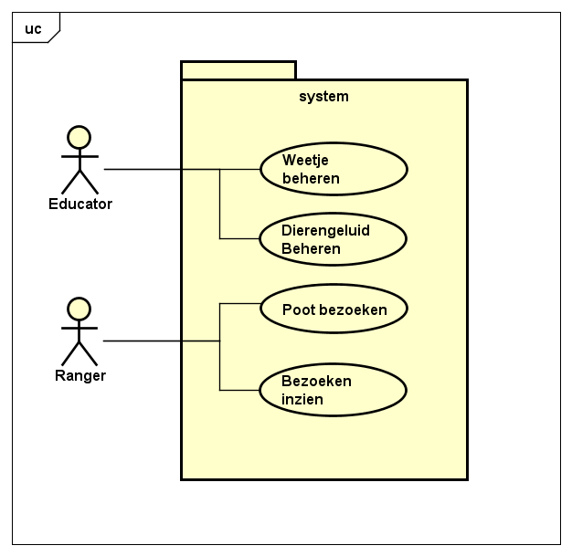

# Functioneel ontwerp
## Inleiding
In dit document wordt beschreven wat er in het project Burgers' Zoo gemaakt gaat worden. Burgers' Zoo heeft de opdracht gegeven om de ervaring in het park te verbeteren door een interactieve speurtocht voor kinderen. Ook wil Burgers' Zoo met deze speurtocht een drijfveer voor kinderen maken om snellere terug te komen naar het park.

Het plan is om door het park heen poten te verstoppen. Dit zijn kastjes in de vormen van een pootafdrukken van dieren. Kinderen krijgen de opdracht op zoek te gaan naar deze poten. Wanneer een kind met de ouders bij de kassa staat om een kaartje te kopen, krijgt het kind een ranger pas. Met dit pasje wordt het kind een échte ranger. Wanneer de ranger een poot vind, kan de ranger zijn rangerpas tegen de poot aanhouden om een weetje te horen te krijgen. Dit weetje vertelt iets leerzaams en grappigs over een van de dieren in de buurt van de plek van de poot.

Wanneer de ranger na een vermoeide dag het park uit gaat, kan de ranger zijn pas inleveren voor een ranger certificaat. Op dit certificaat staat vermeld welke poten de ranger heeft gevonden. De ranger kan thuis op de computer naar een website gaan die vermeld staat op het certificaat. Daar vult de ranger zijn unieke code in die ook op het certificaat staat. Dan krijgt de ranger te zien welke poten hij nog niet gevonden heeft. Dit zorgt ervoor dat de ranger terug wil naar het park om de niet-gevonden poten te vinden.

Het onderwijs team van Burgers' Zoo moet dit systeem kunnen onderhouden. Zo moeten ze op afstand geluidjes kunnen instellen. Dit kunnen ze allemaal doen via een eigen website. Dit is ook onderdeel van het systeem. De technische dienst van Burgers' Zoo gaat zorgen voor het onderhoud op de poten.

Om al het bovenstaande te realiseren in een systeem zijn er requirements en Use Cases opgesteld. Ter ondersteuning hiervan zijn er mockups gemaakt als voorbeeld van hoe de applicaties er uit gaan zien. In dit document is dit alles te lezen.
## Inhoudsopgave

<!-- toc -->

  * [Requirements](#requirements)
    + [Functionele Requirements](#functionele-requirements)
    + [Niet-functionele Requirements](#niet-functionele-requirements)
  * [Domeinmodel](#domeinmodel)
- [Use Cases](#use-cases)
  * [Use Case Diagram](#use-case-diagram)
  * [Use Case 1 en 2 - Weetje Beheren / Dierengeluid Beheren](#use-case-1-en-2---weetje-beheren--dierengeluid-beheren)
    + [Preconditie](#preconditie)
    + [Postconditie](#postconditie)
    + [Success scenario](#success-scenario)
    + [Alternatieve flow - Weetje/dierengeluid verwijderen](#alternatieve-flow---weetjedierengeluid-verwijderen)
    + [Alternatieve flow - Weetje/dierengeluid beluisteren](#alternatieve-flow---weetjedierengeluid-beluisteren)
  * [Use Case 3 - Poot bezoeken](#use-case-3---poot-bezoeken)
    + [Preconditie](#preconditie-1)
    + [Postconditie](#postconditie-1)
    + [Success scenario](#success-scenario-1)
  * [Use Case 4 - Bezoeken inzien](#use-case-4---bezoeken-inzien)
    + [Preconditie](#preconditie-2)
    + [Postconditie](#postconditie-2)
    + [Success scenario](#success-scenario-2)
- [Mockups](#mockups)
    + [Ranger app](#ranger-app)
    + [Administrator app](#administrator-app)

<!-- tocstop -->

## Requirements
Om in kaart te krijgen wat de gebruiker precies moet kunnen met ons systeem, zijn de volgende requirements opgesteld. Ook is er gekeken naar andere eisen die aan het systeem gesteld worden.

### Functionele Requirements
- Een ranger kan een rangerpas verkrijgen aan de kassa.
- Een ranger kan deelnemen aan een speurtocht met een rangerpas.
- Door de rangerpas te scannen aan een poot, maakt de ranger vorderingen in de speurtocht.
- De ranger kan luisteren naar een weetje en een dierengeluid door zijn rangerpas te scannen.
- De ranger kan behaalde resultaten inzien door de website te bezoeken met zijn rangercode.
- De ranger krijgt een rangercode voor thuisgebruik na afloop van zijn bezoek.
- De administrator kan poten configureren door de webinterface te gebruiken.
- De administrator kan nieuwe weetjes en geluiden toevoegen aan het systeem.
- De administrator kan weetjes en geluiden aan een poot toevoegen door de webinterface te gebruiken.
- De administrator kan een lijst van alle weetjes en geluiden zien in de webinterface.
- De administrator kan luisteren naar bestaande weetjes en geluiden in het systeem door de webinterface te gebruiken.

### Niet-functionele Requirements
- Het systeem moet meerdere requests tegelijk aankunnen.
- De poot moet in een vochtige omgeving kunnen staan.
- Het systeem moet kunnen communiceren in een omgeving zonder wifi en gps.

## Domeinmodel
Onderstaand Domeinmodel helpt het systeem in kaart te brengen door termen te gebruiken die de ontwikkelaars en de opdrachtgever allemaal begrijpen. Door deze termen, of concepten, helder te krijgen kunnen ontwikkelaars met de opdrachtgever overleggen over de visie van het systeem.

Wanneer een kind voor het eerst een pas krijgt wordt de pas gekoppeld aan een nieuwe Ranger. Vanaf dat moment is het kind een ranger. Bij een ranger hoort een rangercode die het kind kan gebruiken om de volgende keer dat het kind bij Burgers' Zoo komt verder te gaan als dezelfde ranger.

Een ranger gaat speuren naar poten. Op een saaie plek in het park staan groepjes poten waar rangers naar op zoek kunnen gaan. Een groepje van poten die dicht bij elkaar staan en allemaal het zelfde weetje afspelen heet een speurpunt.

Een ranger bezoekt dus speurpunten. De ranger kan zijn bezoeken aan de speurpunten en het moment dat het speurpunt is bezocht terugvinden in de webapplicatie.

Wanneer een ranger hun pas scant bij de poot dan spreekt de poot een weetje uit. Vervolgens laat de poot een dierengeluid horen van een dichtbijzijnd dier.

Een speurtocht staat niet in het domeinmodel omdat er geen vaste volgorde is waarin een ranger de speurpunten moet bezoeken. Vandaar dat een 'speurtocht' concept niet bestaat.

# Use Cases
Onderstaande Use Cases beschrijven alle handelingen die verschillende gebruikers met het systeem kunnen doen.
## Use Case Diagram
In dit diagram staan alle Use Cases samen met de actoren om duidelijk te krijgen wat er gedaan kan worden met het systeem.

## Use Case 1 en 2 - Weetje Beheren / Dierengeluid Beheren

De onderstaande use case behandelt twee use cases:

1. Weetjes beheren
2. Dierengeluiden beheren

In de use case wordt een aantal keer naar weetje/dierengeluid gerefereerd, dit om duplicatie te voorkomen.

**Primaire Actor**: Educator

**Brief Description**
Een educator kan met behulp van het systeem de weetjes/dierengeluiden die op een bepaalde poot staan beluisteren en aanpassen.

### Preconditie
* De educator heeft een audio bestand beschikbaar met het weetje/dierengeluid.
* De educator weet welke poot hij wil aanpassen.

### Postconditie
* De weetjes/dierengeluiden die geconfigureerd zijn in het systeem zijn te horen op het pootjes.

### Success scenario

|Gebruiker|Systeem|
|---|---|
|1. De educator kiest in het systeem om de weetjes/dierengeluiden van een poot aan te passen.| 2. Het systeem laat een lijst met beschikbare pootjes weergeven. |
| 3. De educator kiest de poot waarvan hij de weetjes/dierengeluiden wil beheren.  | 4. Het systeem toont de weetjes/dierengeluiden die nu op de poot staan. |
| 5. De educator upload een nieuw audio bestand. | 6. Het systeem upload het nieuwe audio bestand stukje voor stukje naar de poot. |
| | 7. Het systeem geeft de voortgang van de upload naar de poot weer. Einde use case. |

### Alternatieve flow - Weetje/dierengeluid verwijderen

| Gebruiker | Systeem |
| --- | --- |
| 5a. De educator kiest ervoor om een bestaand weetje van een poot te verwijderen. | Het systeem verwijdert het weetje vanuit de poot. |
| | Einde use case |

### Alternatieve flow - Weetje/dierengeluid beluisteren

| Gebruiker | Systeem |
| --- | --- |
| 5a. De educator kiest ervoor om een bestaand weetje te beluisteren. | Het systeem laat het weetje op de computer afspelen. |
| | Einde use case |

## Use Case 3 - Poot bezoeken

**Primaire Actor**: Ranger

**Brief Description**
Een ranger bezoekt een poot wanneer de ranger de pas tegen de poot aanhoud. De poot laat een weetje horen.

### Preconditie
* De poot is geconfigureerd met 1 of meerdere weetjes.
* De ranger heeft een pas die bekend is binnen het systeem.
* De ranger heeft nog niet eerder deze poot bezocht

### Postconditie
* De ranger heeft het weetje gehooord.
* Het bezoek van de ranger is terug te zien in de ranger-app.

### Success scenario

|Gebruiker|Systeem|
|---|---|
| 1. De ranger houdt de rangerpas tegen de poot aan. | 2. De poot laat een weetje horen. |
| | Het systeem laat een dierengeluid horen. |
| | Het systeem registreert het bezoek van deze ranger in het systeem. |

## Use Case 4 - Bezoeken inzien

**Primaire Actor**: Ranger

**Brief Description**
Een ranger bezoekt een website waarin hij zijn rangercode invult. Vervolgens kan hij zien welke poten hij in welke volgorde heeft bezocht. Ook kan de ranger zien welke poten hij nog niet heeft gevonden.

### Preconditie
* De ranger is in het park geweest en heeft daar een rangercode ontvangen.

### Postconditie
* De ranger heeft gezien welke poten hij heeft bezocht.
* De ranger heeft gezien welke poten hij heeft gemist.

### Success scenario

|Gebruiker|Systeem|
|---|---|
| 1. De ranger bezoekt een website van het systeem die is meegegeven tijdens het bezoek aan de dierentuin. | 2. Het systeem laat een webpagina zien waar de ranger een rangercode kan invullen |
| 3. De ranger vult zijn rangercode in. | 4. Het systeem laat een kaartje zien met de bezochte poten en een lijstje met poten die de ranger nog niet bezocht heeft. Einde use case. |

# Mockups
De mockups hieronder laten zien hoe de applicaties er uit gaan zien voor de gebruikers van het systeem. Dit zijn eerste schetsen die gemaakt zijn om nog verder op te itereren.

### Ranger app

De ranger app laat de trips zien die een ranger heeft afgelegd, ook geeft deze onderin (en via het menu) de optie om de gehoorde geluidjes nogmaals te horen.

### Administrator app
Als de administrator een poot wil aanpassen komt hij/zij eerst op de pagina waar alle poten weergegeven worden. Dat is de volgende pagina:

Als de administrator ervoor kiest om een poot aan te passen komt hij/zij op het volgende scherm (popup). Hier kan hij/zij onder andere de naam, het geluid, de weetjes en de positie van de poot aanpassen.

De volgende twee schermen tonen de "geluiden beheren" en "weetjes beheren" paginas. Op deze pagina's kan de administrator de weetjes/geluidjes zien en deze afspelen.

Als de administrator op het + knopje rechtsboven drukt krijgt hij/zij het volgende scherm(popup) te zien om een geluid / weetje toe te voegen.

