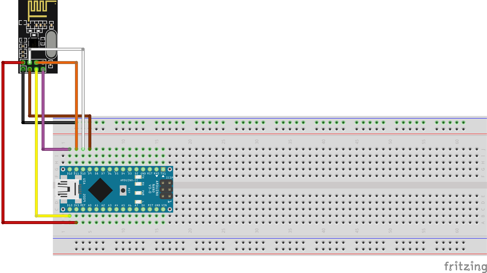
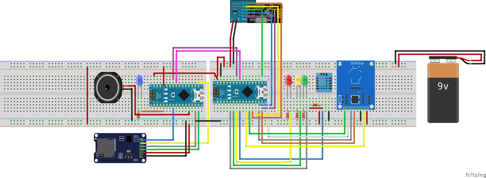

# Opleverdocumentatie

## Inleiding
Vanuit de Hogeschool van Arnhem en Nijmegen (HAN) zijn er multidiciplinaire projectteams samengesteld om het probleem van Burgers' Zoo aan te pakken. Een eerder team heeft acht weken gewerkt aan een mogelijke oplossing. Daarbij zijn er onderzoeken gedaan, concepten ontworpen, prototypes uitgewerkt en getest. De resultaten hiervan zijn in een adviesrapport verwerkt en overhandigd aan een tweede projectteam. Dat projectteam heeft de focus gelegd op de technische haalbaarheid van de ontworpen concepten en dit ook op grotere schaal getest. Dit tweede team heeft de bevindingen hiervan verwerkt in dit document om te overhandigen aan een volgende projectgroep.

Burgers' Zoo heeft vanuit eigen onderzoek aangegeven dat bezoekers zich negatief uiten over de mobiliteit in het park en daardoor hun bezoek als minder prettig ervaren. Het bezoek wordt gezien als een dagtaak wat ook zwaar is door de lange afstanden lopen op heuvelig terrein. Hierdoor zijn bezoekers van het park minder snel geneigd om het park opnieuw te bezoeken. Burgers' Zoo heeft dit probleem voorgelegd aan de HAN, waarna meerdere projectteams hier mee aan de slag zijn gegaan.

In dit rapport wordt allereerst het concept beschreven, gevolgd door een beschrijving en uitleg van de technieken die gebruikt zijn. Daarbij is een handleiding opgenomen om een demo te starten. Daarna wordt er beschreven hoe er verder gewerkt kan worden met de software en hardware die opgeleverd is. Tot slot zijn er aanbevelingen voor een volgende projectteam. Achter aan het verslag is nog een lijst te vinden met installatieinstructies voor de genoemde software producten.

## Inhoudsopgave

<!-- toc -->

- [Concept](#concept)
- [Systeemoverview](#systeemoverview)
- [Gateway](#gateway)
- [Frontend apps](#frontend-apps)
- [Backend](#backend)
- [Database](#database)
- [Opzethandleiding](#opzethandleiding)
  * [A: Starten Backend + Web Apps](#a-starten-backend--web-apps)
    + [randvoorwaarden](#randvoorwaarden)
    + [Het starten van de web applicaties en de database](#het-starten-van-de-web-applicaties-en-de-database)
      - [Development applicaties](#development-applicaties)
      - [productie builds (minified)](#productie-builds-minified)
      - [De applicaties bezoeken](#de-applicaties-bezoeken)
  * [B: Installatie Gateway](#b-installatie-gateway)
    + [MongoDB](#mongodb)
    + [Java](#java)
    + [RXTX](#rxtx)
    + [Aansluiting Arduino](#aansluiting-arduino)
    + [Start gateway](#start-gateway)
  * [C: Poot](#c-poot)
    + [1. Onderdelen](#1-onderdelen)
    + [2. Behuizing](#2-behuizing)
    + [3. Aansluiting](#3-aansluiting)
    + [4. Code uploaden](#4-code-uploaden)
    + [5. SD kaart](#5-sd-kaart)
    + [6. Aanzetten](#6-aanzetten)
      - [Maduino](#maduino)
      - [Auduino](#auduino)
- [Ontwikkelhandleiding](#ontwikkelhandleiding)
  * [Ontwikkeling front-end applicaties](#ontwikkeling-front-end-applicaties)
    + [Redux](#redux)
    + [Folderindeling (package structuur)](#folderindeling-package-structuur)
    + [Tips](#tips)
  * [Ontwikkeling Backend](#ontwikkeling-backend)
  * [Ontwikkeling Gateway](#ontwikkeling-gateway)
  * [Ontwikkeling Poot](#ontwikkeling-poot)
- [Bijlagen](#bijlagen)
  * [Repo commando's](#repo-commandos)
  * [Begrippenlijst](#begrippenlijst)
  * [Software lijst](#software-lijst)

<!-- tocstop -->

## Concept
In het park van Burgers' Zoo wordt een speurtocht uitgezet om zo het mobiliteitsprobleem te verminderen door afleiding voor de kinderen.

Veel voorkomende bezoekers in Burgers' Zoo zijn kinderen met hun (groot)ouders. Kinderen zitten vol met energie en zijn enthousiast dus rennen door het park heen. Tegelijkertijd lopen de ouders hier achteraan en moeten ze de kinderen in de gaten houden. Door het heuvelachtige landschap waarop Burgers' Zoo gebouwd is kan dit heel vermoeiend zijn. Een speurtocht geeft de kinderen afleiding en zorgt er voor dat de kinderen bij een punt in de speurtocht stil blijven staan.
In het park staan bij elk dierenverblijf borden met informatie over de dieren of planten die daar te vinden zijn. Dit zijn vaak lange stukken tekst die de kinderen zelf niet kunnen lezen. Dit zorgt er voor dat de ouders dit moeten voorlezen. Dit brengt dus extra last met zich mee voor de ouders. Dit wordt opgelost met de speurtocht doordat er weetjes afgespeeld worden in kindertaal.

De speurtocht is bedoeld voor kinderen om een ranger te spelen. De kinderen krijgen bij binnenkomst een NFC pas, hun rangerpas, die ze kunnen gebruiken om mee te doen aan de speurtocht. Door het park heen staan speurpunten, in de vorm van een dierenpoot, verspreid. Wanneer een ranger zijn rangerpas scant bij een poot krijgt hij een dierenweetje te horen samen met een dierengeluid. Het doel is om alle dierenpoten te vinden en te scannen. Als de ranger de dierentuin verlaat krijgt hij een ranger certificaat. Op dit certificaat staat een unieke ranger code die hij kan gebruiken om thuis in te loggen op de ranger app.

In de ranger app kan een ranger kijken wat hij allemaal gedaan heeft tijdens zijn bezoek aan Burgers' Zoo. Hier is te vinden welke poten hij wanneer gescand heeft. Hier is te zien welk weetje en dierengeluid er bij hoort, zodat dit nogmaals geluisterd kan worden. De app geeft ook aan welke punten nog niet gescand zijn. Dit kan een aanleiding zijn om het park nog een keer te bezoeken, om zo alle punten van de speurtocht te vinden. Hier kunnen beloningen aan gekoppeld worden in de vorm van korting of een gift. Medewerkers van Burgers' Zoo kunnen de poten en de speurtocht beheren door hier andere dierengeluidjes of weetjes aan toe te voegen.


## Systeemoverview

De poot bestaat uit twee Arduino's. Er is één Arduino die volledig gaat over het afspelen van audio. In een later stadium zou deze Arduino ook verantwoordelijk worden voor het opslaan van nieuw ontvangen audiobestanden. De Audio Arduino wordt aangestuurd door de Master Arduino.

De Master Arduino (genaamd Maduino) is verantwoordelijk voor alle primaire functionaliteiten en het aansturen van de Audio Arduino (genaamd Auduino). Zo zal de master Arduino een NFC-scanner hebben om passen te detecteren. Ook zal deze Master Arduino de temperatuur en luchtvochtigheid meten. De Master Arduino staat via de NRF24 chip in verbinding met de gateway en zal zo de gateway op de hoogte houden over welke passen zijn langs geweest.

## Gateway
De poten zullen communiceren met de twee backends van de twee groepen via een gateway. Deze gateway bestaat uit een Arduino en een Raspberry Pi. De Arduino zal draadloos communiceren via NRF24 chips met de poten en alle informatie doorsturen naar de Raspberry Pi. De Pi zal via HTTP/JSON communiceren met de backend's. De Pi kan op zijn beurt weer de Arduino binnen de gateway aansturen om zo informatie bij de poten te krijgen.

## Frontend apps
De gebruikers zullen werken met een van de twee client-applicaties: de Ranger App voor de rangers en de Admin App voor de administratoren. Deze twee applicaties draaien in de browser en zullen via HTTP/JSON communiceren met de Backends.

De front-end apps zijn modulair opgezet, deze apps draaien op hun eigen plekje en roepen het REST backend middels HTTP aan. Als zei data willen manipuleren zal dit dus ook via de back-end moeten verlopen. Alle front-end apps bij elkaar worden gezien als de "front-end laag", zelfs als deze op andere fysieke machines draaien. Het los koppelen van de applicaties bevordert de werkbaarheid en stabiliteit van de architectuur. Elke app kan afzonderlijk gedeployed / getest worden zonder de rest van de architectuur te beïnvloeden.

## Backend
Het back-end betreft een REST api welke wordt aangesproken met de verschillende front-ends. De REST api zelf spreekt de datalaag aan om zijn data op te slaan en op te halen. Deze laag kan wederom uitgebreid worden met meerdere instanties van de back-end en/of met een loadbalancer.

## Database
De database laag zal enkel en alleen de database bevatten, op het moment van prototyping is dit één Mongo database. Dit kan echter uitgebreid worden met meerdere instances (voor redundancy, uitbreidbaarheid) en eventueel voorzien worden van een load balancer.


## Opzethandleiding
Om het systeem in zijn geheel op te zetten zijn drie onderdelen nodig: Web-Backend + Webapps, Gateway en Poot. In onderstaande drie koppen wordt uitgelegd hoe deze drie onderdelen in te stellen. Wanneer alle drie de onderdelen opgezet zijn kan het systeem gebruikt worden. 

### A: Starten Backend + Web Apps
Dit hoofdstuk zal beschrijven hoe alle webapplicaties, de backend en de database opgestart moeten worden. Ook zal dit hoofdstuk beschrijven hoe de database gevuld kan worden met het seedscript zodat er wat testdata in de apps staat.

#### randvoorwaarden

Om alle applicaties te draaien moeten er een aantal dingen geregeld worden op de pc/laptop.
De tabel hieronder geeft aan welke stukken software benodigd zijn en zal, waar mogelijk, een link worden geven naar de officiele website.

- [mongo](https://www.mongodb.com/)
- [docker](https://www.docker.com/)
- [docker-compose](https://docs.docker.com/compose/)
- [node](https://nodejs.org/)
- [npm](https://www.npmjs.com/)

Als alle bovenstaande software geinstalleerd is dan kunnen alle apps gestart worden, om de database te vullen is er echter nog een extra stukje software nodig. De software heet `mongorestore` en komt , ten tijde van schrijven, mee geinstalleerd met het mongo pakket (Op Windows met [mongotools](https://github.com/mongodb/mongo-tools)). Bekijk [deze website](https://docs.mongodb.com/manual/reference/program/mongorestore/) voor meer informatie.

#### Het starten van de web applicaties en de database

Het volgende hoofdstuk zal uitleggen hoe de applicaties gestart kunnen worden in zowel development modus als productie modus. Voor het testen is alleen de development modus meer als genoeg.

> ***NOTE!  de commando's zijn bedacht voor Linux en Mac OS X, hieronder wordt beschreven hoe het werkt voor alle drie de systemen al is het zeer aan te raden om een Linux Virtual machine op te zetten. (klik [hier](https://www.storagecraft.com/blog/the-dead-simple-guide-to-installing-a-linux-virtual-machine-on-windows/) voor uitleg)***

##### Development applicaties

Om de applicaties in development modus te starten (in Docker) moet het volgende commando worden uitgevoerd:

```cmd
npm start
```

Dit zal, onder water, het volgende draaien:

```cmd
npm run copy-endpoint-dev && docker-compose down && docker-compose up
```

Het commando "copy-endpoint-dev" gaat echter **fout** op een Windows systeem omdat Windows geen fatsoenlijke copy tool op de command line heeft. Als het toch op windows moet draaien moet je de kopieerstap even zelf uitvoeren. De stappen zijn dan als volgt:

1. Kopieer het bestand `./config/dev.json` naar de volgende twee locaties:

    - *./apps/admin/src/constants/external-variables/endpoints.json*
    - *./apps/ranger/src/constants/external-variables/endpoints.json*

2. Draai het `docker-compose down` commando
3. Draai het `docker-compose up` commando


##### productie builds (minified)

Om de applicaties in productie modus te starten (in Docker) moet het volgende commando worden uitgevoerd:

```cmd
npm run build
```

Dit zal, onder water, het volgende draaien:

```cmd
npm run copy-endpoint-prod && docker-compose -f ./dockerfiles/prod/docker-compose.yml down && docker-compose -f ./dockerfiles/prod/docker-compose.yml up && bash seedscript.sh -h servers.rickvanlieshout.com:8019
```

Vervang hier de server (`servers.rickvanlieshout.com:8019`) met de juiste productie server en verander ook de variabelen in `./config/prod.json` naar de benodige productie variabelen.

Het commando "copy-endpoint-dev" gaat echter **fout** op een Windows systeem omdat Windows geen fatsoenlijke copy tool op de command line heeft. Als het toch op windows moet draaien moet je de kopieerstap even zelf uitvoeren. De stappen zijn dan als volgt:

1. Kopieer het bestand `./config/prod.json` naar de volgende twee locaties:

    - *./apps/admin/src/constants/external-variables/endpoints.json*
    - *./apps/ranger/src/constants/external-variables/endpoints.json*

2. Draai het `docker-compose down` commando
3. Draai het `docker-compose up` commando
4. Draai het `bash seedscript.sh SERVERURL` bestand. (op Windows heb je hier de [bash shell voor Windows](https://www.howtogeek.com/249966/how-to-install-and-use-the-linux-bash-shell-on-windows-10/) voor nodig.)

##### De applicaties bezoeken

Om de applicaties te bezoeken, en ze te gebruiken, ga je naar de volgende web adressen:

| Applicatie                  | Adres in develop modus                        | Adres in productie modus                      |
|-----------------------------|-----------------------------------------------|-----------------------------------------------|
| Back-end api                | http://localhost:8001                         | http://localhost:8011                         |
| Admin / educatie applicatie | http://localhost:8002                         | http://localhost:8012                         |
| Ranger applicatie           | http://localhost:8003                         | http://localhost:8013                         |
| De database                 | http://localhost:8009  mongo://localhost:8009 | http://localhost:8009  mongo://localhost:8009 |


### B: Installatie Gateway


Om de gateway werkend te krijgen zijn er een aantal vereisten:

- Raspberry Pi 3.
- Arduino Nano, Mega of Uno met een aangesloten NRF24L01+.
- Er is een werkende versie van `RASPBIAN STRETCH WITH DESKTOP` geïnstalleerd.
- Er is toegang via SSH of direct op de Raspberry Pi 3 terminal toegang.

#### MongoDB
Omdat er het een en ander wordt opgeslagen op de Raspberry Pi 3 moet er een database geïnstalleerd worden, in dit geval MongoDB.

Dit kan op de Raspberry Pi 3 gedaan worden met de volgende commando's in de terminal:

``` bash
$ sudo apt-get update
$ sudo apt-get upgrade
$ sudo apt-get install mongodb-server
```
*Het upgrade process kan een tijdje duren.*

Als de MongoDB server succesvol geïnstalleerd is, kan deze service gestart worden door:
``` bash
$ sudo service mongodb start
```

#### Java
De gateway draait in een JVM en het is dus nodig om de juiste Java installatie te installeren.

``` bash
sudo su
echo "deb http://ppa.launchpad.net/webupd8team/java/ubuntu xenial main" | tee /etc/apt/sources.list.d/webupd8team-java.list
apt-key adv --keyserver hkp://keyserver.ubuntu.com:80 --recv-keys EEA14886
```
Mocht bij het uitvoeren van het bovenstaande een error naar voren komen over het ontbreken van `dirmngr` dan kan dat gefixed worden door dit te installeren:
``` bash
sudo apt-get install dirmngr
```
``` bash
sudo apt-get update
sudo apt-get install oracle-java8-installer
```

#### RXTX

``` bash
sudo apt-get install librxtx-java
```

#### Aansluiting Arduino

*Aansluitschema Arduino Nano met een NRF24L01+*

De Arduino moet vervolgens verbonden worden via een USB kabel met de Raspberry Pi 3.

#### Start gateway
Om de gateway te starten moet eerst de MongoDB aan staan. Dat kan met het eerste commando.
Als deze draait kan daarna de gateway zelf gestart worden.
``` bash
sudo service mongodb start #starts mongo service

java -Djava.library.path=/usr/lib/jni -jar gateway.jar #gateway.jar is te vervangen met de jar naam van de gateway
```
Bij het tweede gedeelte, om Java te starten, is het belangrijk dat de volgende regel voor de -jar komt: `-Djava.library.path=/usr/lib/jni `. Anders wordt de RXTX library niet goed geladen.


### C: Poot
In dit hoofdstuk wordt beschreven hoe een fysieke poot kan worden gebouwd.

#### 1. Onderdelen

TODO: WELKE ONDERDELEN ZIJN NODIG?
TODO: EEPROM MOET LEEG ZIJN  (vraag aan Arne)
Dit doet Sebastiaan

#### 2. Behuizing
De behuizing van de poot bestaat uit een houten voorplaat met op de achterkant een plastic bakje met daarin alle electronica. Hieronder een sfeerimpressie van de behuizing.


Een gedetailieërd ontwerp voor de behuizing is [hier](https://github.com/HANICA-MinorMulti/nj2017-iot-dwa-BurgersZoo1/blob/master/documentatie/technisch-ontwerp/poot-fysiek/poot-fysiek-ontwerp.md) te vinden.

#### 3. Aansluiting

Sluit de twee arduino's aan volgens het onderstaande aansluitschema of gebruik de aansluittabellen daaronder om de verbindingen tussen componenten en Arduino's te maken.



**Auduino**

| Component  | Pin op Component | Pin op Arduino |
|------------|------------------|----------------|
| Blauwe LED | +                | D2             |
| Blauwe LED | -                | GND            |
| Speaker    | +                | D9             |
| Speaker    | -                | GND            |
| SD-reader  | SCK              | D13            |
| SD-reader  | CS               | D4             |
| SD-reader  | MOSI             | D11            |
| SD-reader  | MISO             | D12            |
| SD-reader  | VCC              | 5V             |
| SD-reader  | GND              | GND            |
| Maduino    | A4               | A4             |
| Maduino    | A5               | A5             |
| Maduino    | GND              | GND            |

**Maduino**

| Component  | Pin op Component | Pin op Maduino   |
|------------|------------------|------------------|
| Groene LED | +                | D2               |
| Groene LED | -                | GND              |
| Oranje LED | +                | D3               |
| Oranje LED | -                | GND              |
| Rode LED   | +                | D4               |
| Rode LED   | -                | GRND             |
| NRF        | VCC              | 3.3V             |
| NRF        | GND              | GND              |
| NRF        | CE               | D10              |
| NRF        | CSN / CS         | D9               |
| NRF        | CSK              | D13              |
| NRF        | MOSI             | D11              |
| NRF        | MISO             | D12              |
| NRF        | IRQ              | NIET AANGESLOTEN |
| RFID       | VCC              | 3.3V             |
| RFID       | RST              | D7               |
| RFID       | GND              | GND              |
| RFID       | MISO             | D12              |
| RFID       | MOSI             | D11              |
| RFID       | SCK              | D13              |
| RFID       | NSS              | D8               |
| RFID       | IRQ              | NIET AANGESLOTEN |


#### 4. Code uploaden

TODO: LINK NAAR BUILT HEX FILES + UITLEG OVER HOE JE DEZE UPLOAD
Dit doet Sijmen

#### 5. SD kaart

TODO: HOE SD KAART FORMATTEREN?
TODO: NAAMGEVING VAN BESTANDEN OP SD KAART
TODO: UITLEG CONVERSIE AUDIO NAAR JUISTE FORMAAT
Dit doet Thomas

#### 6. Aanzetten
Nadat alle bovenstaande stappen doorlopen zijn kunnen de twee Arduino's op stroom worden gezet. Vervolgens gaan de twee Arduino's initialiseren. Om te kunnen zien of onderdelen goed worden geinitialiseerd moet worden gekeken naar de statuslampjes. Per Arduino is hieronder te vinden wat de statuslampjes betekeken.

##### Maduino
Als alles goed gaat dan gaan er 3 lampjes branden zodra de Maduino wordt opgestart. Wanneer het initialiseren compleet is gaan de drie lampjes uit. Verder zijn er een aantal abnormale lampcodes. Deze zijn hieronder uitgewerkt.

| Gedrag | Betekenis |
| --- | --- |
| Alle lampjes blijven aan staan. | Bezig met opstart sequence. Zoalang de Arduino nog niet verbonden is met een gateway worden deze lampjes laten zien. Als dit lang zo blijft staan dan is er waarschijnlijk iets mis met de NRF24L01+ óf kan de gateway niet worden gevonden. |
| Geel lampje continu aan | Er kan niet worden verbonden met de auduino. Er is iets mis met het verzenden naar de Auduino met I2C. |
| Geel lampje kort knipper | Er wordt verzonden naar de Auduino. Wanneer je een hele korte gele knipper ziet dan wordt er een signiaaltje verzonden naar de Auduino. |
| Rood lampje 0.5 seconde knipper | De gescande pas kon niet worden geauthenticeerd. |
| Rood lampje 1 seconde knipper | De gescande heeft niet de inhoud `Burgers Zoo`. |
| Groen lampje 1 seconde aan | Er is een valide pas gescant. |

##### Auduino
De Auduino laat geen led branden als er hij niks aan het doen is. De volgende statussen kunnen worden afgelezen van de blauwe status led:

| Gedrag | Betekenis |
| --- | --- |
| Blauwe led knippert snel | De SD kaart lezer kon niet worden geinitialiseerd. |
| Blauwe led brand continu | Er wordt een geluidje afgespeeld |


## Ontwikkelhandleiding
Om verder aan het systeem te kunnen ontwikkelen is dit hoofdstuk in het leven geroepen. Hieronder wordt uitgelegd hoe de ontwikkelomgevingen in te stellen en wat er nodig is om de code te kunnen begrijpen. 

### Ontwikkeling front-end applicaties

De front-end applicaties zijn opgebouwd met een React seed van [Corey House](https://github.com/coryhouse), namelijk [react-slingshot](https://github.com/coryhouse/react-slingshot). Corey heeft op zijn Github repository een [uitgebreide uitleg](https://github.com/coryhouse/react-slingshot/blob/master/README.md#get-started) staan over het werken met zijn slingshot seed. De gekozen bundler voor dit project is [Webpack](https://webpack.js.org/).

#### Redux

Het maken van een applicatie in React kan snel uit de hand lopen als je applicatie groter wordt. Om structuur in de applicatie
aan te brengen is gekozen om Redux te gebruiken.

Met Redux beheer je state op applicatieniveau. Redux bestaat
uit een aantal onderdelen maar het belangrijkste dat je moet onthouden zijn de volgende drie:

- **store**: opslagplaats van alle data als één groot object (POJO).
- **reducers**: pure functies die de app-state bewerken op basis van binnengekregen data uit zgn. action creators.
- **action creators**: functies die iets doen, bijvoorbeeld een API benaderen of iets uitrekenen. De uitkomst geven ze door aan de reducers. Dat doorgeven wordt ***'dispatchen'*** genoemd.


#### Folderindeling (package structuur)

De folderindeling hanteert de naamgevingen van Redux, zodat iedereen die weet wat Redux is meteen snapt waar files moeten komen te staan.

```
.
├── /build/                     # De folder voor gecompileerde output
├── /node_modules/              # 3rd-party libraries en utilities
├── /src/                       # The source code of the application
│   ├── /actions/               # Action creators zoals beschreven in Redx
│   ├── /components/            # React components die enkel UI logica bevatten
│   ├── /constants/             # Constantes die over meerdere files gebruikt worden
│   ├── /containers/            # React components die toegang hebben tot de Redux app state
│   ├── /reducers/              # Redux reducers
│   ├── /routes/                # Page/screen components met routing informatie
│   ├── /store/                 # Bevat configuratie die nodig is om de Redux store op te bouwen
│   ├── /styles/                # Bevat styling files die over meerdere componenten gebruikt wordt
│   ├── /index.ejs              # Template voor de index.html file, wordt door webpack gebruikt
│   ├── /index.jsx              # Startup script, koppelt React aan de DOM
│   └── ...                     # Overige core files die door webpack gebruikt worden.
├── /tools/                     # Build automation scripts en utilities die webpack gebruikt.
├── package.json                # De lijst met 3rd party libraries en utilities
```

#### Tips
Op Linux en Mac OS X zit verder nog een limiet op het aantal bestanden / mappen waar een gebruiker tegelijk naar mag "luisteren" voor veranderingen. Om dat op te lossen moet je het volgende commando uitvoeren:

```
echo fs.inotify.max_user_watches=524288 | sudo tee -a /etc/sysctl.conf && sudo sysctl -p
```

<sub>Voor technische info klik [hier](https://github.com/emcrisostomo/fswatch), voor sysctl uitleg [klik](https://wiki.archlinux.org/index.php/sysctl) hier.</sub>


### Ontwikkeling Backend

*DIT HOOFDSTUK WORDT IN WEEK 7 OF 8 VERDER AFGEMAAKT*

### Ontwikkeling Gateway

*DIT HOOFDSTUK WORDT IN WEEK 7 OF 8 VERDER AFGEMAAKT*

### Ontwikkeling Poot

*DIT GAAT GEDAAN WORDEN IN WEEK 7 OF WEEK 8*

## Bijlagen

### Repo commando's

In deze bijlage wordt uitgelegd wat de "repo commando's" inhouden.
Een "repo commando" is één van de scripts die in de package.json staan.

Dat levert de volgende items op:


| Commando                    | resultaat                                                                                              | Notities                                  |
|-----------------------------|--------------------------------------------------------------------------------------------------------|-------------------------------------------|
| start                       | Start de apps in development modus                                                                     |                                           |
| build                       | Start de apps in productie modus (en bouwt productie files)                                            |                                           |
| build-docker                | Bouwt zowel de dev als de productie docker images.                                                     |                                           |
| build-docker-dev            | Bouwt de dev docker image.                                                                             |                                           |
| build-docker-prod           | Bouwt de productie docker image                                                                        |                                           |
| compile-deliverables        | Bouwt alle documentatie                                                                                |                                           |
| compile-images              | Verzamelt alle images in de deliverables/images map zodat ze gebruikt kunnen worden in de documentatie | ! werkt niet op Windows                   |
| compile-pva                 | Bouwt het Plan van Aanpak                                                                              | Wordt gebouwt in de deliverables map      |
| compile-fo                  | Bouwt het Functioneel ontwerp                                                                          | Wordt gebouwt in de deliverables map      |
| compile-to                  | Bouwt het technisch ontwerp                                                                            | Wordt gebouwt in de deliverables map      |
| compile-testplan            | Bouwt het testplan                                                                                     | Wordt gebouwt in de deliverables map      |
| compile-opleverdocumentatie | Bouwt de opleverdocumentatie                                                                           | Wordt gebouwt in de deliverables map      |
| generate-pdfs               | Zet alle gebouwde bestanden om naar een .pdf                                                           | Wordt gebouwt in de deliverables/pdfs map |
| copy-endpoint-prod          |  Dit kopieërd alle development instellingen naar de apps                                                                                                     | ! werkt niet op Windows                   |
| copy-endpoint-dev           |  Dit kopieërd alle development instellingen naar de apps                                                   | ! werkt niet op Windows                   |
| postinstall                 | Dit script draait NA een npm install en zal de "build-docker" taak uitvoeren                           |                                           |


### Begrippenlijst

| Begrip | Uitleg |
|--------|--------|
|        |        |
|        |        |
|        |        |


### Software lijst
In deze lijst vindt je voor de meeste software links naar installatiehandleidingen.

| Product | Windows | Mac OS X | Linux |
|---------|---------|----------|-------|
|   Mongo      | [link](https://docs.mongodb.com/manual/installation/) | [link](https://docs.mongodb.com/manual/installation/)  |   [link](https://docs.mongodb.com/manual/installation/)      |
|  Docker   |  [link](https://docs.docker.com/toolbox/toolbox_install_windows/)       |    [link](https://docs.docker.com/docker-for-mac/install/)      |   [link](https://docs.docker.com/engine/installation/linux/docker-ce/ubuntu/)    |
|   docker-compose      |   [link](https://docs.docker.com/compose/install/)      |   [link](https://docs.docker.com/compose/install/)       |  [link](https://docs.docker.com/compose/install/)      |
|node|  [link](http://blog.teamtreehouse.com/install-node-js-npm-windows)       |     [link](http://nodesource.com/blog/installing-nodejs-tutorial-mac-os-x/)     |  [link](https://nodejs.org/en/download/package-manager/)     |
|npm|  [link](https://www.npmjs.com/package/npm)       |   [link](https://www.npmjs.com/package/npm)       |    [link](https://www.npmjs.com/package/npm)   |
|    bash     |   [link](https://www.howtogeek.com/249966/how-to-install-and-use-the-linux-bash-shell-on-windows-10/)      |    -      |    -   |


<!--
    |         |         |          |       |
    |         |         |          |       |
-->
