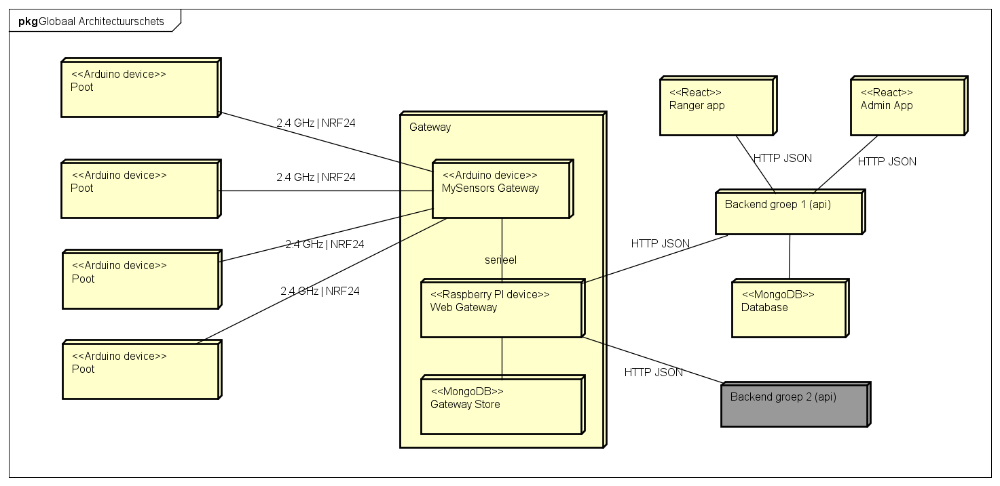
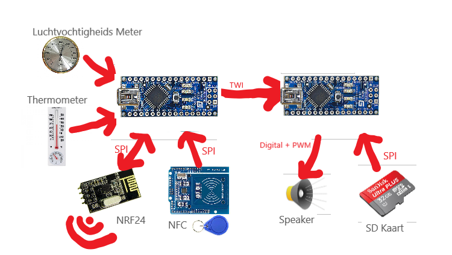
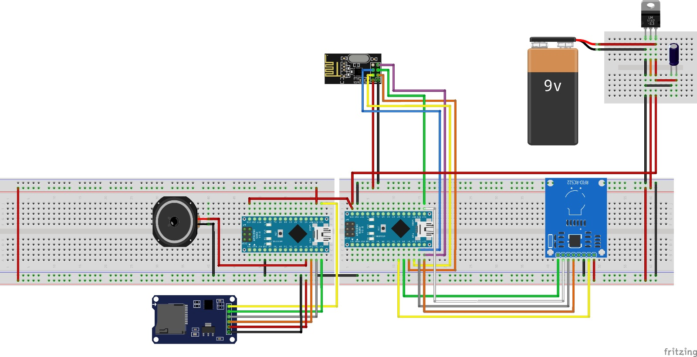

# Technisch ontwerp

<!-- toc -->

- [Inleiding](#inleiding)
- [Architectuur](#architectuur)
  * [Poot](#poot)
  * [Gateway](#gateway)
  * [Frontend apps](#frontend-apps)
  * [Backend](#backend)
  * [Database](#database)
  * [Keuzes](#keuzes)
    + [Gebruik gateway voor communicatie tussen poten en backend](#gebruik-gateway-voor-communicatie-tussen-poten-en-backend)
    + [Gateway bestaande uit een Arduino + Raspberry Pi](#gateway-bestaande-uit-een-arduino--raspberry-pi)
    + [Poot bestaande uit twee Arduino's](#poot-bestaande-uit-twee-arduinos)
    + [Losstaande client-apps's](#losstaande-client-appss)
    + [De datastorage](#de-datastorage)
    + [De back-end](#de-back-end)
    + [De front-ends](#de-front-ends)
    + [De ontwikkelomgeving](#de-ontwikkelomgeving)
- [Datamodel](#datamodel)
- [Data Opslag](#data-opslag)
- [System flow](#system-flow)
  * [Nieuwe poot aanmelden](#nieuwe-poot-aanmelden)
  * [Online komen poot](#online-komen-poot)
  * [Poot versturen logdata](#poot-versturen-logdata)
  * [Ranger bezoekt poot](#ranger-bezoekt-poot)
- [Poot](#poot-1)
      - [Onderdelen poot](#onderdelen-poot)
      - [Aansluitschema](#aansluitschema)
- [Deployment](#deployment)
  * [Beide versies](#beide-versies)
  * [Development versie](#development-versie)
  * [Productie versie](#productie-versie)
- [Class Diagram IoT Poot](#class-diagram-iot-poot)
      - [AuduinoPortal & MaduinoPortal](#auduinoportal--maduinoportal)
      - [Poot](#poot-2)
      - [RangerDetector](#rangerdetector)
      - [GatewayLink](#gatewaylink)
      - [Logging](#logging)
        * [TempSensor](#tempsensor)
        * [HumiditySensor](#humiditysensor)
      - [Audio](#audio)
        * [Player << TMRPMC &gt;&gt;](#player--tmrpmc-gtgt)
        * [Downloader](#downloader)
      - [StatusLight](#statuslight)
        * [LED](#led)

<!-- tocstop -->

# Inleiding

Het Burgers' Zoo Ranger systeem bestaat uit tien fysieke componenten waarop source code draait:

- Een Raspberry Pi
- Twee back-ends
- Twee database servers
- Drie clients
- Een Arduino bij de Raspberry pi voor nrf24
- Twee Arduino's (per poot)

Dit document beschrijft het systeem op architectuur niveau, inclusief subsystemen, services, hardware mapping en gebruikte protocollen. Het doel is om de lezer te informeren over het systeem, zonder in de code te hoeven duiken. Naast informatie is er ook argumentatie voor de gemaakte keuzes.

Normaal gesproken is een technisch ontwerp volgens de HAN een gedetailleerd document, met gedefiniëerde classes, dependencies, interfaces, packages en sequence diagrammen. Dit zit er nu niet in, omdat het maken er van te veel overhead creëert vanwege een continu wijzigend prototype. Het [uitgebreide functioneel ontwerp (FO)](https://github.com/HANICA-MinorMulti/nj2017-iot-dwa-BurgersZoo1/blob/master/deliverables/functioneel%20ontwerp.md) en [de api specificatie](https://github.com/HANICA-MinorMulti/nj2017-iot-dwa-BurgersZoo1/blob/master/documentatie/api/swagger%20api%20beschrijving.yaml) bevatten samen met dit technisch ontwerp genoeg informatie om de relatief kleine code base te begrijpen.

# Architectuur
In onderstaande afbeelding is een globale schets van de architectuur weergegeven.

## Poot
De architectuur van de poot is in onderstaande afbeelding in meer detail te zien.

De poot bestaat uit twee Arduino's. Er is één Arduino die volledig gaat over het afspelen van audio. In een later stadium zou deze Arduino ook verantwoordelijk worden voor het opslaan van nieuw ontvangen audiobestanden. De Audio Arduino wordt aangestuurd door de Master Arduino.

De Master Arduino is verantwoordelijk voor alle primaire functionaliteiten en het aansturen van de Audio Arduino. Zo zal de master Arduino een NFC-scanner hebben om passen te detecteren. Ook zal deze Master Arduino de temperatuur en luchtvochtigheid meten. De Master Arduino staat via de NRF24 chip in verbinding met de gateway en zal zo de gateway op de hoogte houden over welke passen zijn langs geweest.

## Gateway
De poten zullen communiceren met de twee backends van de twee groepen via een gateway. Deze gateway bestaat uit een Arduino en een Raspberry Pi. De Arduino zal draadloos communiceren via NRF24 chips met de poten en alle informatie doorsturen naar de Raspberry Pi. De Pi zal via HTTP/JSON communiceren met de backend's. De Pi kan op zijn beurt weer de Arduino binnen de gateway aansturen om zo informatie bij de poten te krijgen.

## Frontend apps
De gebruikers zullen werken met een van de twee client-applicaties: de Ranger App voor de rangers en de Admin App voor de administratoren. Deze twee applicaties draaien in de browser en zullen via HTTP/JSON communiceren met de Backends.

De front-end apps zijn modulair opgezet, deze apps draaien op hun eigen plekje en roepen het REST backend middels HTTP aan. Als zei data willen manipuleren zal dit dus ook via de back-end moeten verlopen. Alle front-end apps bij elkaar worden gezien als de "front-end laag", zelfs als deze op andere fysieke machines draaien. Het los koppelen van de applicaties bevordert de werkbaarheid en stabiliteit van de architectuur. Elke app kan afzonderlijk gedeployed / getest worden zonder de rest van de architectuur te beïnvloeden.

## Backend
Het back-end betreft een REST api welke wordt aangesproken met de verschillende front-ends. De REST api zelf spreekt de datalaag aan om zijn data op te slaan en op te halen. Deze laag kan wederom uitgebreid worden met meerdere instanties van de back-end en/of met een loadbalancer.

## Database
De database laag zal enkel en alleen de database bevatten, op het moment van prototyping is dit één Mongo database. Dit kan echter uitgebreid worden met meerdere instances (voor redundancy, uitbreidbaarheid) en eventueel voorzien worden van een load balancer.

## Keuzes
Tijdens het opstellen van de architectuur zijn verschillende keuzes gemaakt. Hieronder zijn de belangrijkste keuzes met argumentatie te lezen.

### Gebruik gateway voor communicatie tussen poten en backend
Het stond vast dat er een backend zou komen voor het opslag van de bezoekersgegevens en monitoringsgegevens. Hoe gaat deze backend communiceren met de poten in het park? De poten zouden via draadloos via NRF24 chips gaan communiceren. Er moet dus een apparaat zijn dat de NRF24 chips kan begrijpen én die de HTTP-taal van de backend kan begrijpen. De oplossing hiervoor is een gateway die verbind met de poten met NRF24 chips en met de backend communiceert via HTTP. Ook zorgt de gateway ervoor dat de backend niet fysiek in het park hoeft te zijn. Met een gateway kunnen de poten communiceren met de backend die in de 'cloud' draait.

### Gateway bestaande uit een Arduino + Raspberry Pi
Er is geprobeerd een NRF24 chip aan te sluiten op een Raspberry Pi om draadloos te communseren met de poten. In [dit](https://github.com/HANICA-MinorMulti/nj2017-iot-dwa-BurgersZoo1/blob/master/documentatie/onderzoeken/oplossingsRichtingenGatewayTaal/onderzoeken.md) onderzoek is te lezen dat dit niet mogelijk is. Vandaar dat er gekozen is om een Arduino met NRF24 chip aan de Raspberry Pi via Seriële  poort te koppelen. Zo kan op de Raspberry Pi gewerkt worden met het Seriële  protocol dat breed ondersteund wordt en kan op de Arduino de [MySensors gateway software](https://www.mysensors.org/build/serial_gateway) draaien. De MySensors code op de Arduino regelt op deze manier bijvoorbeeld ook de acknowledgements en opnieuw versturen van berichten.

### Poot bestaande uit twee Arduino's
In eerste instantie was er gekozen om de poot te maken [met 1 Arduino](https://github.com/HANICA-MinorMulti/nj2017-iot-dwa-BurgersZoo1/tree/docs/documentatie/onderzoeken/ArduinoVsRaspberry). De keuze was mede gebaseerd op het [onderzoek dat vertelde dat in theorie het mogelijk was om alle aparaten op dezelfde SPI bus aan te sluiten](https://github.com/HANICA-MinorMulti/nj2017-iot-dwa-BurgersZoo1/tree/docs/documentatie/onderzoeken/spi). Helaas is de praktijk anders. Na testen is gebleken dat het in praktijk niet werkt om NRF, NFC en SD allemaal op via SPI op dezelfde Arduino aan te sluiten. Ook zou het niet mogelijk zijn om een Arduino te gebruiken als [MySensors repeater](https://www.mysensors.org/about/network) wanneer de Arduino audio aan het afspelen is. Dit is niet praktisch, sinds repeateating functionaliteit nodig is in het grote park. Daarom is er gekozen om één Arduino te gebruiken om audio af te spelen, en een andere audio voor de communicatie.

### Losstaande client-apps's
Er is gekozen om de Ranger App en Admin App volledig los te maken van de backend. De client apps zullen beide met dezelfde rest api van de backend werken. De keuze is hiervoor gemaakt omdat tijdens de lessen DWA dit pattern gebruikt is.

Tijdens het ontwikkelingsprocess worden er verschillende keuzes gemaakt, voor sommige keuzes is uitgebreid onderzoek gedaan en sommige zijn wat sneller gemaakt door de omstandigheden. De keuzes m.b.t de web software (de back-end en de react apps) worden hieronder uitgelegd.

### De datastorage

Als datastorage is er gekozen voor MongoDB. De belangrijkste argumenten hiervoor waren ontwikkelsnelheid en de kans dat datastructuur gaat veranderen. In een document store is dit makkelijker te ondervangen dan in een relationele database. Verder heeft Loopback, het programma dat gebruikt wordt om de backend te maken, een prima ondersteuning voor MongoDB. Het onderzoek hiernaar is [hier](https://github.com/HANICA-MinorMulti/nj2017-iot-dwa-BurgersZoo1/blob/master/documentatie/onderzoeken/app-datastore/app%20datastore.md) te lezen.

### De back-end

De belangrijkste beweegreden bij het opzetten van de back-end is "het moet snel kunnen veranderen", dit omdat er gebruik wordt gemaakt van een snel veranderende omgeving waarin veel prototypes gebouwt worden.

Mede door deze rede is er gekozen om een model based framework toe te passen, dit zou ervoor zorgen dat een groot gedeelte van de back-end gegenereerd kan worden. Naar deze generators is onderzoek gedaan en daar is [Loopback of Swagger](https://github.com/HANICA-MinorMulti/nj2017-iot-dwa-BurgersZoo1/blob/master/documentatie/onderzoeken/generators/generators.md) uitgekomen. Later is besloten om nog een [onderzoek te doen naar Loopback](https://github.com/HANICA-MinorMulti/nj2017-iot-dwa-BurgersZoo1/blob/master/documentatie/onderzoeken/loopback/loopbackOnderzoek.md) om te kijken hoe hier een api mee te genereren, dit omdat swagger generatie bij de groep al bekend was.

### De front-ends

Om de front-ends snel met een goede basis op te zetten is [React slingshot](https://github.com/coryhouse/react-slingshot) gebruikt. Uit [onderzoek](https://github.com/HANICA-MinorMulti/nj2017-iot-dwa-BurgersZoo1/blob/master/documentatie/onderzoeken/frontend-design-pattern/onderzoek-frontend-design-pattern.md) is verder nog gebleken dat de [material-ui-next](https://material-ui-next.com/) library het meest geschikt was om snel een intuïtieve applicatie op te zetten.

### De ontwikkelomgeving

Om met meerdere developers makkelijk te kunnen werken en om ervoor te zorgen dat een vervolggroep gemakkelijk alles kan laten starten moet er een ontwikkelomgeving komen. Er is hier gekozen voor [Docker](https://www.docker.com/), uit [onderzoek](https://github.com/HANICA-MinorMulti/nj2017-iot-dwa-BurgersZoo1/blob/master/documentatie/onderzoeken/docker/docker.md) bleek dat dit de beste optie was omdat het zo simpel werkt. Met Docker kunnen we ook garanderen dat het op iedere machine hetzelfde werkt en in de toekomst gemakkelijk schalen.

# Datamodel

TODO

# Data Opslag
Om de data van het systeem op te slaan wordt er een Mongo database gebruikt. Deze database wordt gevuld door Loopback. Loopback werkt iets anders dan Mongo met data omdat het een model systeem gebruikt.

In Loopback genereer je models met eigenschappen. Deze eigenschappen staan gelijk aan de keys uit de key-value pairs in een document in Mongo. Elk model staat ook gelijk aan een collection in Mongo. Als je een relatie maakt tussen twee modellen wordt dit door middel van links of embedded documents, afhankelijk van de relatie, verwerkt in Mongo.

Een globale weergave van de data in de database is hieronder te zien. Dit bevat alleen de data van de twee webapplicaties, nog niet de data die de gateway nodig heeft.

Vanuit de API specificatie die gemaakt is voor de gateway komt er nog een andere databehoefte naar boven. Beide dataschema's samen zijn verwerkt in de API, dat levert onderstaand dataschama op. Hierin zijn de relaties tussen de verschillende modellen te zien.

# System flow

## Nieuwe poot aanmelden

Wanneer een totaal nieuwe poot in het systeem komt, moet deze aangemdeld worden binnen het systeem. Dit sequence diagram beschrijft de gebeurtenissen bij het aanmelden van een nieuwe poot. Deze poot heeft nog geen configuraties. De bedoeling is dat de poot een ID krijgt van de backend waarmee de poot identificeerbaar is.

## Online komen poot

Wanneer een poot uit heeft gestaan en weer online komt (bijvoorbeeld voor onderhoud of bij stroomuitval), zal deze een opstart sequence doorlopen. Wanneer een poot voor het eerst wordt opgestart zal de sequence diagram voor "*Nieuwe poot aanmelden*" doorlopen worden.

Na het aanmelden bij de gateway zal de gateway aan de backend vragen naar de configuratie van de poot. De backend zal de configuratie terug sturen naar de gateway. Wanneer de confiuratie van de poot gelijk is gebleven zal de gateway geen actie ondernemen. Anders zal de gateway de audio bestanden downloaden en lokaal opslaan zodat deze later niet gedownload hoeft te worden.

De audio bestanden die nog niet op de poot voorkomen zullen dan verzonden worden naar de poot en op de gateway wordt bijgewerkt welke audo files op de poot staan. Gedurende het verzenden van de audio files zal de gateway ook updates naar de backend sturen om de voortgang te melden.

## Poot versturen logdata

De poot verstuurt periodiek logdata naar de gateway. De gateway zal een timestamp toevoegen en een JSON object opbouwen. De timestap wordt bij de gateway toegevoegd sinds de poot geen besef van tijd heeft. Dit object wordt doorgestuurd naar de backend. Onder logdata valt ook informatie over dat een ranger de poot heeft bezocht.

## Ranger bezoekt poot
Link naar use case: [Link naar use case](https://github.com/HANICA-MinorMulti/nj2017-iot-dwa-BurgersZoo1/blob/docs/documentatie/use%20cases/pas%20scannen/pas%20scannen.md)

Wanneer een ranger een poot bezoekt scant de ranger de NFC kaart. De poot verstuurt het id dat op de pas staat door naar de gateway. De gateway voegt een timestamp toe aan het het scannen van de kaart en stuurt dit door naar de backend.

# Poot

De poot is het punt waar kinderen hun passen kunnen gaan scannen. Door ontbreken van bestaande netwerk infrastructuur hebben wij de keuze gemaakt om zelf een zelfhelend mesh netwerk op te zetten doormiddel van NRF24L01+ chips icm de [MySensor library](https://www.mysensors.org/). 

De passen die gescand worden hebben een NFC chip, waarbij het unike id van deze kaart dient als identificatie nummer. Dit nummer wordt daarna verzonden via het mesh netwerk naar de backend.

#### Onderdelen poot
- 2 Arduino Nano's
- NRF24L01+
- SD/Micro SD kaart lezer
- RFID lezer
- Speaker via 3.5 mm jack
- Vorm van voeding (voor het prototype)
- Capacitor
- Voltage Regulator

Er is gekozen voor twee verschillende Arduino Nano's omdat er anders problemen onstaan met het afspelen van audio en ontvangen/versturen van data via de NRF24L01+. Deze twee chips maken allebei gebruik van de SPI bus en kunnen dus niet tegelijkertijd worden aangesproken. Om dit op te lossen zijn de Arduino's in een master/slave opstelling. Er is dan één Arduino verantwoordelijk voor de aansturing, ontvangen/versturen van berichten en uitlezen van RFID lezer. De andere Arduino Nano is verantwoordelijk voor het uitlezen van de SD/Micro SD kaart en het ontvangen van commando's van de master.

#### Aansluitschema
Deze communiceren met elkaar via I2C. Er is gekozen voor I2 en niet voor bijvoorbeeld de seriële poort omdat we tijdens het prototypen nog gemakkelijk de Arduino's kunnen debuggen.

# Deployment

Voor dit project wordt er gewerkt met twee deployment strategieën: deployment en productie. Het doel is om de productie build online te hebben bij de field-test, want dan simuleer je een echte situatie. We hebben echter ook een development deployment omgeving nodig om tegelijk te testen en bugs op te zoeken.

## Beide versies
Beide versies draaien op een black-box server waar [Docker](https://www.docker.com/) containers gedraaid kunnen worden (al dan niet met [docker-compose](https://docs.docker.com/compose/)). Voor zowel development- als productie deployment wordt docker gebruikt.

## Development versie

In de development deployment worden de softwareproducten gedraaid met hun built-in development servers. (bijv. npm start -> dev react app)

Dit staat ons toe om snel te schakelen tussen de verschillende producten aangezien er niks gebuild hoeft te worden.

## Productie versie
In de productie versie is alle code getranspileerd (gebundeld) tot één geminimaliseerde JavaScript file dat op de webserver draait:

# Class Diagram IoT Poot

Zoals te zien is, is er een tweedeling van klasse in Maduino en Auduino. Dit is zoals beschreven in de [architectuur](https://github.com/HANICA-MinorMulti/nj2017-iot-dwa-BurgersZoo1/tree/master/documentatie/architectuur). Maduino is de naam voor de Master Arduino en Auduino is de naam voor de Audio Arduino.

#### AuduinoPortal & MaduinoPortal
Het 'AuduinoPortal' en 'MaduinoPortal' zorgen voor de communicatie tussen de Maduino en de Auduino. Ze werken beide op de I2C bus. Het AuduinoPortal stuurt dus berichtjes die worden ontvangen bij de MaduinoPortal. Andersom kan de MaduinoPortal berichten sturen naar de AuduinoPortal.

Deze twee portals zijn er alleen voor communicatie naar elkaar. Beide zullen bij het ontvangen van berichtjes een klasse binnen die Arduino aanroepen die dan de actie afhandelt.

Een voorbeeld: wanneer de 'RangerDetector' een ranger detecteert, wordt dit doorgegeven aan 'Poot'. Op zijn beurt zal 'Poot' op 'AuduinoPortal' de methode 'playAudio()' afroepen. Vervolgens zal 'AuduinoPortal' via de I2C bus de 'MaduinoPortal' informeren dat er audio moet worden afgespeeld. De 'MaduinoPortal' roept dan op de 'Audio' klasse 'playAudio()' aan. Zo wordt de audio afgespeeld.

#### Poot
De 'Poot' klasse is soort van de baas van het management van alle subsysteempjes die op de poot draaien. Zo zal deze klasse de globale business logica implementeren. De 'Poot' zal vanuit de ranger-detectie module te horen krijgen dat er een ranger voor de poot staat en zal de poot module de audio module en de logging module aansturen om hierop te reageren.

De 'Poot' klasse zorgt ook voor registratie en aanmelden van de poot bij de gateway en het opslaan van het pootid in EEPROM.

#### RangerDetector
Deze is verantwoordelijk voor het detecteren van welke ranger er voor de paal staat. Op dit moment wordt deze geïmplementeerd door een RFID-lezer uit te lezen en de data uit de pasjes te lezen. De 'RangerDetector' rapporteert terug naar 'Poot' zodat de 'Poot' kan besluiten wat te doen met dit event.

#### GatewayLink
Alle communicatie naar de gateway wordt gedaan door de 'GatewayLink'. Zo zal de 'Gatewaylink' methodes hebben waarmee de 'Logging' en 'RangerDetector' naar kunnen praten.

#### Logging
Deze module verzamelt informatie die te maken heeft met de uitvoering en omgeving van de poot. Bijvoorbeeld temperatuur, luchtvochtigheid, stroomverbruik en communicatie-informatie. Logging geeft de verzamelde informatie door aan de 'GatewayLink' die zorgt dat deze informatie bij de gateway aankomt.

##### TempSensor
Een klasse die een fysieke thermometer beheert. Deze thermometer wordt uitgelezen door de 'Logging'.

##### HumiditySensor
Een klasse die een fysieke luchtvochtigheidsmeter beheert. Deze luchtvochtimeter wordt uitgelezen door de 'Logging'.

#### Audio
Het afspelen en beheren van alle audiogerelateerde zaken wordt geregeld door de 'Audio' module. De audio module wordt via de 'AudionoPortal' en 'MaduinoPortal' aangestuurd via de 'Poot'. De Audio module zal de audio bestanden vanuit de 'SD-Card' lezer ophalen.

##### Player << TMRPMC &gt;&gt;
De [TMRPMC](https://github.com/TMRh20/TMRpcm/wiki) library wordt gebruikt voor het afspelen van de library. Binnen het systeem wordt dit het 'Player' component genoemd.

##### Downloader
De downloader verzorgt het ontvangen van nieuwe audio-bestanden vanuit de 'Communication' module. Dit ontvangen van audio-bestanden zal een speciaal protocol vereisen. Hiervoor zorgt de downloader.
** DE DOWNLOADER ZAL IN EEN LATER STADIUM VERDER GESPECIFICEERD WORDEN. **

#### StatusLight
Geeft door middel van een fysiek lampje feedback aan mensen die de paal onderhouden over het werk van de paal. Zo kan er een lampje zijn dat door middel van knipperen het verkeer op de communicatiekanalen aangeeft, of een lampje dat laat zien of er audio afgespeeld wordt. Het doel van de het 'StatusLight' is een visuele indicatie geven van wat er binnenin de Arduino afspeelt.

##### LED
Representeert een fysiek led lampje op een bepaalde fysieke pin op de Arduino. Kan worden aangezet of uitgezet.

