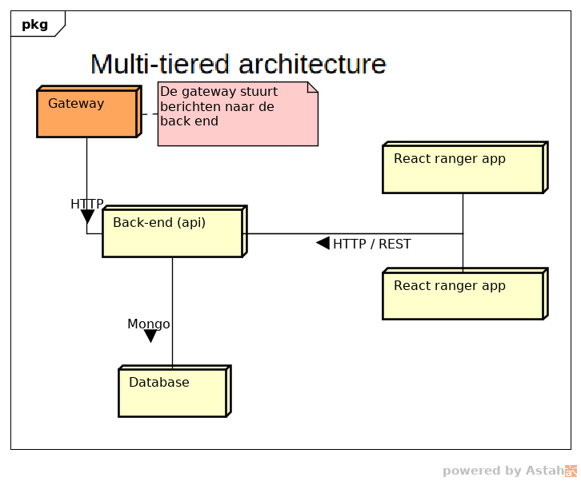

# Technisch ontwerp

<!-- toc -->

  * [Inleiding](#inleiding)
  * [Systeem architectuur](#systeem-architectuur)
- [Architectuur](#architectuur)
  * [Keuzes](#keuzes)
      - [Gebruik gateway voor communicatie tussen poten en backend](#gebruik-gateway-voor-communicatie-tussen-poten-en-backend)
      - [Gateway bestaande uit een Arduino + Raspberry Pi](#gateway-bestaande-uit-een-arduino--raspberry-pi)
      - [Poot bestaande uit twee Arduino's](#poot-bestaande-uit-twee-arduinos)
      - [Losstaande client-apps's](#losstaande-client-appss)
  * [Software architectuur](#software-architectuur)
  * [Multi-tiered](#multi-tiered)
  * [Database](#database)
  * [back-end](#back-end)
  * [front-end apps](#front-end-apps)
  * [Technische realisatie](#technische-realisatie)
    + [Technische keuzes](#technische-keuzes)
  * [De back-end](#de-back-end)
    + [interface](#interface)
    + [Data opslag structuur](#data-opslag-structuur)
  * [Database](#database-1)
    + [poot](#poot)
- [Sequence diagrams](#sequence-diagrams)
  * [Nieuwe poot aanmelden](#nieuwe-poot-aanmelden)
  * [Online komen poot](#online-komen-poot)
  * [Poot versturen logdata](#poot-versturen-logdata)
  * [Ranger bezoekt poot](#ranger-bezoekt-poot)
  * [Deployment](#deployment)
- [deployment](#deployment)
  * [Beide versies](#beide-versies)
  * [Development versie](#development-versie)
  * [Productie versie](#productie-versie)

<!-- tocstop -->

## Inleiding

Dit is een inleiding

## Systeem architectuur

# Architectuur
In onderstaande afbeelding is een globale schets van de architectuur weergegeven.

De poten zullen communiceren met de twee backends van de twee groepen via een gateway. Deze gateway bestaat uit een Arduino en een Raspberry Pi. De Arduino zal draadloos communiceren via NRF24 chips met de poten en alle informatie doorsturen naar de Raspberry Pi. De Pi zal via HTTP/JSON communiceren met de backend's. De Pi kan op zijn beurt weer de Arduino binnen de gateway aansturen om zo informatie bij de poten te krijgen.

De gebruikers zullen werken met een van de twee client-applicaties: de Ranger App voor de rangers en de Admin App voor de administratoren. Deze twee applicaties draaien in de browser en zullen via HTTP/JSON communiceren met de Backends.

De architectuur van de poot is in onderstaande afbeelding in meer detail te zien.

De poot bestaat uit twee Arduino's. Er is één Arduino die volledig gaat over het afspelen van audio. In een later stadium zou deze Arduino ook verantwoordelijk worden voor het opslaan van nieuw ontvangen audiobestanden. De Audio Arduino wordt aangestuurd door de Master Arduino.

De Master Arduino is verantwoordelijk voor alle primaire functionaliteiten en het aansturen van de Audio Arduino. Zo zal de master Arduino een NFC-scanner hebben om passen te detecteren. Ook zal deze Master Arduino de temperatuur en luchtvochtigheid meten. De Master Arduino staat via de NRF24 chip in verbinding met de gateway en zal zo de gateway op de hoogte houden over welke passen zijn langs geweest.

## Keuzes
Tijdens het opstellen van de architectuur zijn verschillende keuzes gemaakt. Hieronder zijn de belangrijkste keuzes met argumentatie te lezen.

#### Gebruik gateway voor communicatie tussen poten en backend
Het stond vast dat er een backend zou komen voor het opslag van de bezoekersgegevens en monitoringsgegevens. Hoe gaat deze backend communiceren met de poten in het park? De poten zouden via draadloos via NRF24 chips gaan communiceren. Er moet dus een apparaat zijn dat de NRF24 chips kan begrijpen én die de HTTP-taal van de backend kan begrijpen. De oplossing hiervoor is een gateway die verbind met de poten met NRF24 chips en met de backend communiceert via HTTP. Ook zorgt de gateway ervoor dat de backend niet fysiek in het park hoeft te zijn. Met een gateway kunnen de poten communiceren met de backend die in de 'cloud' draait.

#### Gateway bestaande uit een Arduino + Raspberry Pi
Er is geprobeerd een NRF24 chip aan te sluiten op een Raspberry Pi om draadloos te communseren met de poten. In [dit](https://github.com/HANICA-MinorMulti/nj2017-iot-dwa-BurgersZoo1/blob/master/documentatie/onderzoeken/oplossingsRichtingenGatewayTaal/onderzoeken.md) onderzoek is te lezen dat dit niet mogelijk is. Vandaar dat er gekozen is om een Arduino met NRF24 chip aan de Raspberry Pi via Seriële  poort te koppelen. Zo kan op de Raspberry Pi gewerkt worden met het Seriële  protocol dat breed ondersteund wordt en kan op de Arduino de [MySensors gateway software](https://www.mysensors.org/build/serial_gateway) draaien. De MySensors code op de Arduino regelt op deze manier bijvoorbeeld ook de acknowledgements en opnieuw versturen van berichten.

#### Poot bestaande uit twee Arduino's
In eerste instantie was er gekozen om de poot te maken [met 1 Arduino](https://github.com/HANICA-MinorMulti/nj2017-iot-dwa-BurgersZoo1/tree/docs/documentatie/onderzoeken/ArduinoVsRaspberry). De keuze was mede gebaseerd op het [onderzoek dat vertelde dat in theorie het mogelijk was om alle aparaten op dezelfde SPI bus aan te sluiten](https://github.com/HANICA-MinorMulti/nj2017-iot-dwa-BurgersZoo1/tree/docs/documentatie/onderzoeken/spi). Helaas is de praktijk anders. Na testen is gebleken dat het in praktijk niet werkt om NRF, NFC en SD allemaal op via SPI op dezelfde Arduino aan te sluiten. Ook zou het niet mogelijk zijn om een Arduino te gebruiken als [MySensors repeater](https://www.mysensors.org/about/network) wanneer de Arduino audio aan het afspelen is. Dit is niet praktisch, sinds repeateating functionaliteit nodig is in het grote park. Daarom is er gekozen om één Arduino te gebruiken om audio af te spelen, en een andere audio voor de communicatie.

#### Losstaande client-apps's
Er is gekozen om de Ranger App en Admin App volledig los te maken van de backend. De client apps zullen beide met dezelfde rest api van de backend werken. De keuze is hiervoor gemaakt omdat tijdens de lessen DWA dit pattern gebruikt is.

## Software architectuur

De architectuur m.b.t hetgeen buiten de poten om draait ziet er als volgt uit:

## Multi-tiered
Bij de ontwikkeling van de architectuur is rekening gehouden met het feit dat we een prototype ontwerpen, omdat de producten in dit prototype vaak kunnen veranderen is het verstandig om te kijken naar een modulaire architectuur. Hierin is gekozen voor een "multi-tiered" aanpak. Dit wil, in het kort, zeggen dat er verschillende "lagen" worden gemaakt die ieder verantwoordelijk zijn voor één aspect van het systeem. Deze draaien ieder op een aparte host, hetzij in een container of op een fysieke server.

De verschillende "lagen" worden in de volgende hoofdstukken uitgelegd.

## Database
De database laag zal enkel en alleen de database bevatten, op het moment van prototyping is dit één Mongo database. Dit kan echter uitgebreid worden met meerdere instances (voor redundancy, uitbreidbaarheid) en eventueel voorzien worden van een load balancer.

Al deze dingen samen maken de "data" laag, hét centrale punt om data op te halen met de rest van de applicaties.

## back-end
Het back-end betreft een REST api welke wordt aangesproken met de verschillende front-ends. De REST api zelf spreekt de datalaag aan om zijn data op te slaan en op te halen. Deze laag kan wederom
uitgebreid worden met meerdere instanties van de back-end en/of met een loadbalancer.

## front-end apps

De front-end apps zijn modulair opgezet, deze apps draaien op hun eigen plekje en roepen het REST backend middels HTTP aan. Als zei data willen manipuleren zal dit dus ook via de back-end moeten verlopen.

Alle front-end apps bij elkaar worden gezien als de "front-end laag", zelfs als deze op andere fysieke machines draaien. Het los koppelen van de applicaties bevordert de werkbaarheid en stabiliteit van de architectuur. Elke app kan afzonderlijk gedeployed / getest worden zonder de rest van de architectuur te beïnvloeden.

## Technische realisatie

### Technische keuzes

#

Tijdens het ontwikkelingsprocess worden er verschillende keuzes gemaakt, voor sommige keuzes is uitgebreid onderzoek gedaan en sommige zijn wat sneller gemaakt door de omstandigheden. De keuzes m.b.t de web software (de back-end en de react apps) worden hieronder uitgelegd.

## De back-end

De belangrijkste beweegreden bij het opzetten van de back-end is "het moet snel kunnen veranderen", dit omdat er gebruik wordt gemaakt van een snel veranderende omgeving waarin veel prototypes gebouwt worden.

Mede door deze rede is er gekozen om een model based framework toe te passen, dit zou ervoor zorgen dat een groot gedeelte van de back-end gegenereerd kan worden. Naar deze generators is onderzoek gedaan en daar is [Loopback of Swagger](https://github.com/HANICA-MinorMulti/nj2017-iot-dwa-BurgersZoo1/blob/master/documentatie/onderzoeken/generators/generators.md) uitgekomen. Later is besloten om nog een [onderzoek te doen naar Loopback](https://github.com/HANICA-MinorMulti/nj2017-iot-dwa-BurgersZoo1/blob/master/documentatie/onderzoeken/loopback/loopbackOnderzoek.md) om te kijken hoe hier een api mee te genereren, dit omdat swagger generatie bij de groep al bekend was.

### interface

(wat voor programma's zijn er gebruikt, react, nodjes etc.)

### Data opslag structuur

## Database
Om de data van het systeem op te slaan wordt er een Mongo database gebruikt. Deze database wordt gevuld door Loopback. Loopback werkt iets anders dan Mongo met data omdat het een model systeem gebruikt.

In Loopback genereer je models met eigenschappen. Deze eigenschappen staan gelijk aan de keys uit de key-value pairs in een document in Mongo. Elk model staat ook gelijk aan een collection in Mongo. Als je een relatie maakt tussen twee modellen wordt dit door middel van links of embedded documents, afhankelijk van de relatie, verwerkt in Mongo.

Een globale weergave van de data in de database is hieronder te zien. Dit bevat alleen de data van de twee webapplicaties, nog niet de data die de gateway nodig heeft.

Vanuit de API specificatie die gemaakt is voor de gateway komt er nog een andere databehoefte naar boven. Beide dataschema's samen zijn verwerkt in de API, dat levert onderstaand dataschama op. Hierin zijn de relaties tussen de verschillende modellen te zien.

### poot

# Sequence diagrams

## Nieuwe poot aanmelden

Wanneer een totaal nieuwe poot in het systeem komt, moet deze aangemdeld worden binnen het systeem. Dit sequence diagram beschrijft de gebeurtenissen bij het aanmelden van een nieuwe poot. Deze poot heeft nog geen configuraties. De bedoeling is dat de poot een ID krijgt van de backend waarmee de poot identificeerbaar is.

## Online komen poot

Wanneer een poot uit heeft gestaan en weer online komt (bijvoorbeeld voor onderhoud of bij stroomuitval), zal deze een opstart sequence doorlopen. Wanneer een poot voor het eerst wordt opgestart zal de sequence diagram voor "*Nieuwe poot aanmelden*" doorlopen worden.

Na het aanmelden bij de gateway zal de gateway aan de backend vragen naar de configuratie van de poot. De backend zal de configuratie terug sturen naar de gateway. Wanneer de confiuratie van de poot gelijk is gebleven zal de gateway geen actie ondernemen. Anders zal de gateway de audio bestanden downloaden en lokaal opslaan zodat deze later niet gedownload hoeft te worden.

De audio bestanden die nog niet op de poot voorkomen zullen dan verzonden worden naar de poot en op de gateway wordt bijgewerkt welke audo files op de poot staan. Gedurende het verzenden van de audio files zal de gateway ook updates naar de backend sturen om de voortgang te melden.

## Poot versturen logdata

De poot verstuurt periodiek logdata naar de gateway. De gateway zal een timestamp toevoegen en een JSON object opbouwen. De timestap wordt bij de gateway toegevoegd sinds de poot geen besef van tijd heeft. Dit object wordt doorgestuurd naar de backend. Onder logdata valt ook informatie over dat een ranger de poot heeft bezocht.

## Ranger bezoekt poot
Link naar use case: [Link naar use case](https://github.com/HANICA-MinorMulti/nj2017-iot-dwa-BurgersZoo1/blob/docs/documentatie/use%20cases/pas%20scannen/pas%20scannen.md)

Wanneer een ranger een poot bezoekt scant de ranger de NFC kaart. De poot verstuurt het id dat op de pas staat door naar de gateway. De gateway voegt een timestamp toe aan het het scannen van de kaart en stuurt dit door naar de backend.

## Deployment

# deployment

Voor dit project zal er gewerkt worden met twee deployment strategieën, dit wordt gedaan omdat de deployment tijdens het testen minder secure hoeft te zijn dan tijdens echte productie. Het doel is om de productie build online te hebben bij de field-tests.

## Beide versies
Beide versies draaien op een black-box server waar [Docker](https://www.docker.com/) containers gedraaid kunnen worden (al dan niet met [docker-compose](https://docs.docker.com/compose/)). Voor zowel de development deployments als de productie deployments wordt docker gebruikt.

## Development versie

In de development deployment worden de softwareproducten gedraaid met hun built-in development servers. (bijv. npm start -> dev react app)

Dit staat ons toe om snel te schakelen tussen de verschillende producten aangezien er niks gebuild hoeft te worden.

## Productie versie

