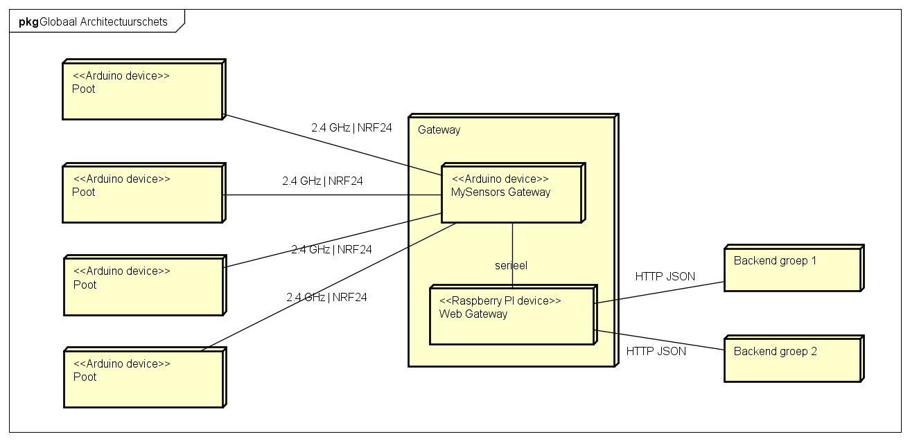
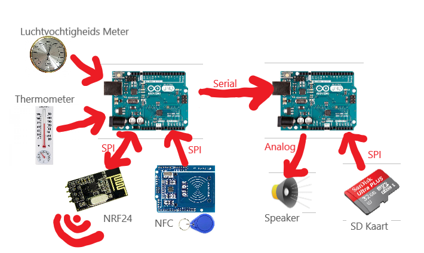

# Architectuur
In onderstaande afbeelding is een globale schets van de architectuur weergegeven.

De poten zullen communiceren met de twee backends van de twee groepen via een gateway. Deze gateway bestaat uit een Arduino en een Raspberry Pi. De Arduino zal communiceren via NRF met de poten en alle informatie doorsturen naar de Raspberry Pi. De Pi zal via HTTP/JSON communiceren met de backend's. De Pi kan op zijn beurt weer de Arduino binnen de gateawy aansturen om zo informatie bij de poten te krijgen.

De gebruikers zullen werken met een van de twee client-applicaties: de Ranger App voor de rangers en de Admin App voor de administratoren. Deze twee applicaties draaien in de browser en zullen via HTTP/JSON communiceren met de Backend's.

De architectuur van de poot is in onderstaande afbeelding in meer detail te zien.

De poot bestaat uit twee Arduino's. Er is één Arduino die volledig gaat over het afspelen van audio. In een later stadium zou deze Arduino ook verantwoordelijk worden voor het opslaan van nieuw ontvangde audiobestanden. De Audio Arduino wordt aangestuurd door de Master Arduino.

De Master Arduino is verantwoordeling voor alle primaire functionaliteiten en het aansturen van de Audio ARduino. Zo zal de master arduino een NFC scanner hebben om passen te detecteren. Ook zal deze Master Arduino de temperatuur en luchtvochtigheid meten. De Master Arduino staat via de NRF24 chip in verbinding met de gateawy en zal zo de gateway op de hoogte houden over welke passen zijn langsgeweest. 

## Keuzes
Tijdens het opstellen van de architectuur zijn verschilende keuzes gemaakt. Hieronder zijn de belangrijkste ASR's met argumentatie te vinden.

#### Gebruik gateway voor communicatie tussen poten en backend
Het stond vast dat er een backend zou komen voor het opsalg van de bezoekersgegevens en monitoringsgegevens. Hoe gaat deze backend communiceren met de poten in het park? De poten zouden via NRF's gaan communiceren. Er moet dus een aparaat zijn dat de NRF's kan begrijpen én die de HTTP-taal van de backend kan begrijpen. De oplossing hiervoor is een gateway die verbind met de poten via NRF's en met de backend communiceert via HTTP. Ook zorgt de gateway ervoor dat de backend niet fisiek in het park hoeft te zijn. Met een gateway kunnen de poten communiceren met de backend die in de 'cloud' draait. 

#### Gateway bestaande uit een Arduino + Raspberry Pi
Er is geprobeerd een NRF24 chip aan te sluiten op een Raspberry Pi. In [dit](https://github.com/HANICA-MinorMulti/nj2017-iot-dwa-BurgersZoo1/blob/master/documentatie/onderzoeken/oplossingsRichtingenGatewayTaal/onderzoeken.md) onderzoek is te lezen dat dit niet mogelijk is. Vandaar dat er gekozen is om een Arduino met NRF24 chip aan de Raspberry Pi via Seriele poort te koppelen. Zo kan op de Raspberry Pi gewerkt worden met het seriele protocool dat breed ondersteund wordt en kan op de Arduino de [MySensors gateway software](https://www.mysensors.org/build/serial_gateway) draaien. De MySensors code op de Arduino regelt op deze manier bijvoorbeelt ook de acknowledgements en hersturing van berichten.

#### Poot bestaande uit twee Arduino's
In eerste instantie was er gekozen om de poot te maken [met 1 Arduino](https://github.com/HANICA-MinorMulti/nj2017-iot-dwa-BurgersZoo1/tree/docs/documentatie/onderzoeken/ArduinoVsRaspberry). De keuze was mede gebaseerd op het [onderzoek dat vertelde dat in theorie het mogelijk was om alle devices op de zelfde SPI bus aan te sluiten](https://github.com/HANICA-MinorMulti/nj2017-iot-dwa-BurgersZoo1/tree/docs/documentatie/onderzoeken/spi). Helaas is de praktijk anders. Na testen is gebleken dat het in praktijk niet werkt om NRF, NFC en SD allemaal op via SPI op de zelfde arduino aan te sluiten. Ook zou het niet mogelijk zijn om een Arduino te gebruiken als [MySensors repeater](https://www.mysensors.org/about/network) wanneer de arduino audio aan het afspelen is. Dit is niet praktisch, sinds repeateating functionaliteit nodig is in het grote park. Daarom is er gekozen om één Arduino te gebruiken om audio af te spelen, en een andere audio voor de communicatie.

#### Losstaande client-apps's
Er is gekozen om de Ranger App en Admin App volledig los te maken van de backend. De client apps zullen beide met de zelfde rest api van de backend wekren. De keuze is hiervoor gemaakt omdat tijdens de lessen DWA dit pattern gebruikt is.

