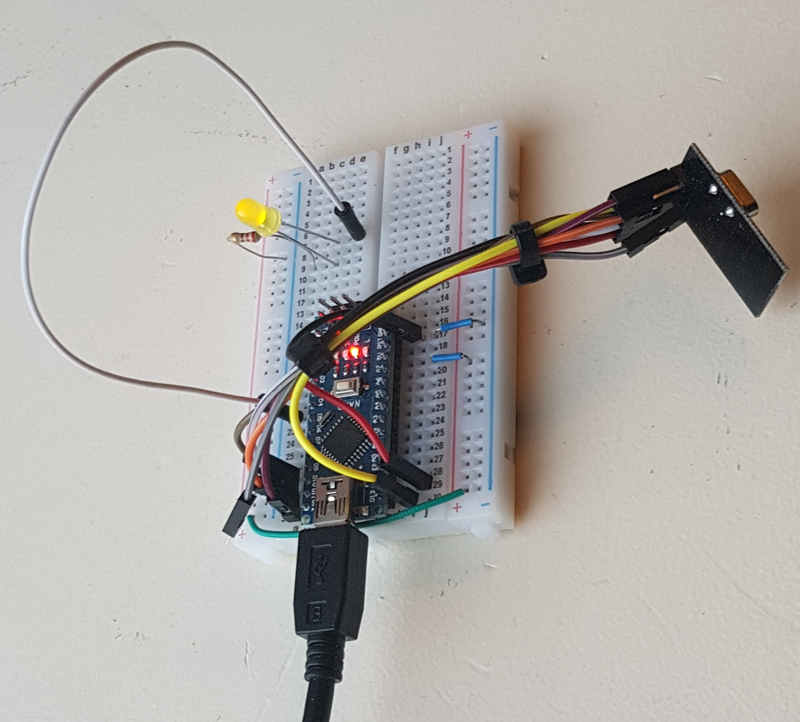

Onderzoek Arduino Timers
----------------
Onderzoeksmethode (uit de cmd method pack):
Prototyping uit Stepping Stones

## Hypothese 
Vanuit de IoT groep is er een wens om verschillende componenten te kunnen timen. Omdat er geen `delay()` gebruik kan worden, zodat niet de hele Arduino aan het wachten is, moeten we dit gaan timen op een andere manier. De wens vanuit de IoT groep is dan ook om een simpele manier dit te kunnen doen en we willen kijken wat makkelijker is, via een library (en welke zijn er?) of dat elk component zijn eigen logica bevat en dus ook zelf timed. 

## Testopzet
Ik ga een kleine testopstelling maken die er ongeveer zo uit komt te zien: .
Aangesloten zijn een NRF24L01+ (die overigens niet gebruikt wordt, deze opstelling wordt hergebruikt), een Led met resistor en een Arduino Nano is te zien.

Fritzing schema voor dit prototype:
 

Ik ga vervolgens hier twee simpele classen voor schrijven die wat logica uitvoeren (ledje laten knipperen en seriële communicatie. Vervolgens ga ik kijken hoe ik dat kan timen en zal dat op de twee verschillende manieren doen (componenten die zelf logica bevatten en via een library).

Alle code van de tests zijn de vinden in de map [code](code).

### Voorbeeld 1
Het eerste prototype ga ik maken met de logica in de module zelf. Ik hou de laatste keer bij en vergelijk dat dan met de huidige tijd en kijk of dit al langer is dan X seconden:

```
unsigned long currTime = millis();
if(currTime - this->lastChange >= TIMECONSTANT){
	// logica
}
```

De code voor deze uitwerking is te vinden in [code/arduinoTimer1](code/arduinoTimer1).

### Voorbeeld SimpleTimer
Voor dit voorbeeld heb ik gebruik gemaakt van de [SimpleTimer](https://playground.arduino.cc/Code/SimpleTimer) library. 
Het is niet een library die normaal vanaf Github gedownload kan worden of via de Arduino zoek library functie te vinden is. De installatie wordt uitgevoerd door handmatig het h en cpp bestand te kopiereeren naar je workspace. 

SimpleTimer werkt volgens de onderstaande theorie:
```cpp
lastMillis = 0
forever do:
	if (millis() - lastMillis > n)
 	call the particular piece of code
		lastMillis = millis()
	end
 end
``` 
Dit zou dan vertalen naar een object waar de timers geregistreerd worden. Deze handelt het dan, via de bovenstaande theorie af. Het verschil met het zelf implementeren zou dan al snel richting leesbaarheid en naar de vraag gaan wie is verantwoordelijk voor de timing? Dat is een van de vragen die we moeten stellen bij de implementaite keuze.

Uiteindelijk werkt de SimpleTimer in het prototype met de volgende code:
```cpp
void ledLoop(){
  led->loop();
}

void serialLoop(){
  serialService->loop();
}

void setup() {
  Serial.begin(9600);
  serialService = new SerialService();
  pinMode(4, OUTPUT);
  led = new Led();
  timer.setInterval(500, ledLoop);
  timer.setInterval(3000, serialLoop);
}

void loop() {
  timer.run();
}
```

Omdat deze library werkt met functiepointers kan er niet verwezen worden naar een methode op een object. Er moet dan een tweede functie gemaakt worden die de methode aanroept. Dit is een probleem aangezien wij met OO code bezig zijn. Hier zullen we dus rekening mee moeten houden bij de keuze. 

Code voor het voorbeeld met de SimpleTimer library is te vinden in de map [code/arduinoTimer2](code/arduinoTimer2).

### Resultaat
Er zijn nog meer libraries te vinden die hetzelfde principe implementeren maar via een iets andere methode. Hiervan zijn na een korte zoekopdracht verschillende voorbeelden van te vinden zoals [Timer](https://playground.arduino.cc/Code/Timer). Ze hebben eigenlijk allemaal dezelfde ideeën met ongeveer dezelfde implementatie of functie. Zo werkt de als voorbeeld genoemde [Timer](https://playground.arduino.cc/Code/Timer) library voor het direct aansturen van pinnen.
 
Het eerste voorbeeld heeft als voordeel dat in de .cpp file direct zichtbaar is hoe de code werkt en hoe het aangeroepen wordt. Verder kan ik ook snel zien om de hoeveel seconden de functies worden uitgevoerd. De andere methode heeft als voordeel dat het goed leesbaar is, maar als nadeel moet je wel direct een functie pointer mee kunnen geven. Ook krijg je een hoop programma code kado die we niet hoeven te gaan gebruiken voor ons project.

Als wij de keuzen gaan maken moeten we dus rekening mee houden dat wij OO bezig zijn en dus extra code moeten toevoegen om de aanroep met functiepointers werkbaar te maken. Ook moeten wij ons afvragen waar we de verantwoordelijkheid willen leggen.