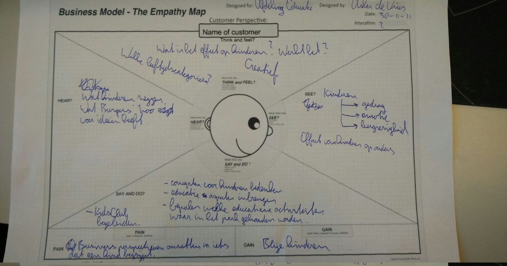
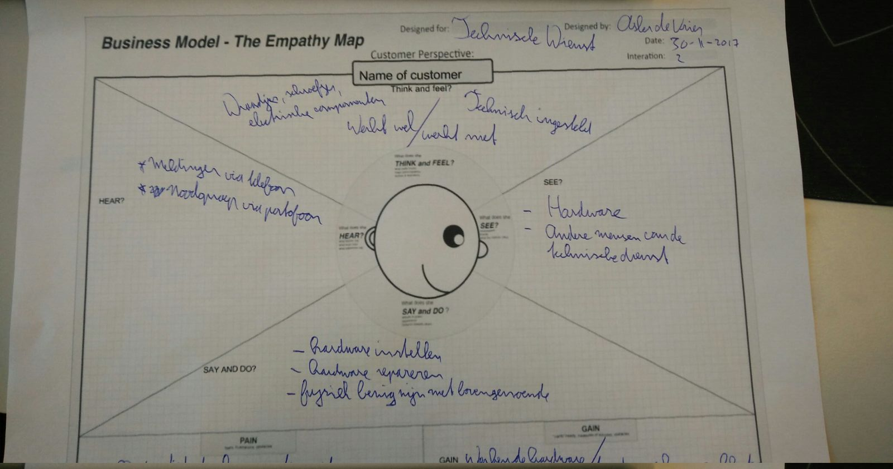
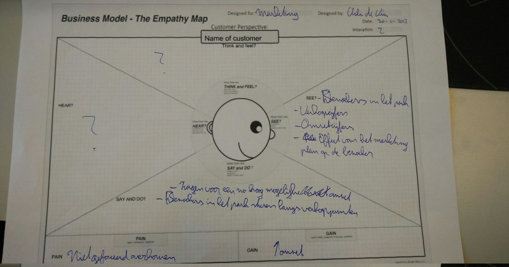

# Empathy map 

## Onderzoeksmethode

**Categorie**: Stepping Stones  
**Naam**: Empathy map

## Inleiding
Dit onderzoek is geschreven voor het Burgers' Zoo Ranger project dat loopt van 13 november tot 26 januari. Het project bevindt zich nu nog in de beginfase en voor de software-ontwikkelaars moet er boven tafel komen hoe de technische dienst en de bezoekers nou het park beleven, om zo een beter beeld te krijgen van hoe de software gebruikt wordt straks. De reden dat er voor de methode Empathy Map gekozen is, is dat het waardevolle en onverwachte inzichten biedt in de eindgebruiker: Wat doen ze? Wat denken ze? Wat zeggen ze? Hoe ziet een dag in het park er uit voor de technische dienst? Willen ze zo veel mogelijk achter een computer zitten of juist niet? Hoe denken en doen kinderen als ze het park bezoeken? En zo zijn er nog veel meer vragen die in het onderzoek aan bod zullen komen.

**Doel** 
Het doel van het onderzoek is op papier krijgen dat, wat er in de resterende tijd van het project ontwikkeld gaat worden, in lijn is met de parkbeleving van een ranger en van de technische dienst. 

## Hypothese
Een empathy map is een bewezen onderzoeksmethode. Daarom verwachten wij dat het doel behaald wordt:

"De empathy map helpt de ontwikkelaars van het Burgers' Zoo Ranger project om software te ontwikkelen die in lijn is met de parkbeleving van een ranger en van de technische dienst."

Die hypothese wordt getest door in week 5 van het project een demo te geven van alle applicaties en dan terug te refereren naar de empathy maps.

## Vooronderzoek
Eerst is een [uitgebreide guide](https://www.uxpin.com/studio/blog/the-practical-guide-to-empathy-maps-creating-a-10-minute-persona/) geraadpleegd die meer over empathy map uitlegt dan de beknopte CMD-kaart. Er wordt vooral uitgelegd wat de termen 'say', 'do', 'hear', 'think', 'feel', 'pain' en 'gain' betekenen en in een template staan wat voorbeelden:

|           | Definitie                                                                      | Voorbeeld                                                                                     |
|-----------|--------------------------------------------------------------------------------|-----------------------------------------------------------------------------------------------|
| do        | Wie is iemand en welke taken voert iemand uit?                                 | Onderhouden van dierenhokken als dierenverzorger                                              |
| see       | Wat ziet iemand dat zijn werk kan beïnvloeden?                                 | Dieren, andere verzorgers, bezoekers                                                          |
| hear      | Wat hoort iemand dat zijn werk kan beïnvloeden?                                | Wat collega's hebben gedaan/gaan doen, hoe dieren reageren op een schone en vieze verblijven. |
| pain/gain | Resp: Welke obstakels moet iemand overwinnen om iets uiteindelijk te bereiken? | In een ruimte staan met gevaarlijke dieren om eten te geven                                   |

Er wordt ook bevestigd dat een empathy meer waarde heeft in het begin van het project dan later in het project. 

## Testopzet
Op donderdag 30 november 2017 wordt een interview gehouden met een vertegenwoordiger van Burgers' Zoo. Er worden een aantal lege empathy map [templates](https://docs.google.com/drawings/d/1Q4ZNsY1J0ZHS_vujT4IJh9I3Nk6TCsVvkZbaeiBwLkM/edit?ntd=1) meegenomen die worden ingevuld tijdens het interview.

## Resultaat

Educatie team
  

Technische dienst
  

Marketing
  

## Conclusie
De hypothese _"De empathy map helpt de ontwikkelaars van het Burgers' Zoo Ranger project om software te ontwikkelen die in lijn is met de parkbeleving van een ranger en van de technische dienst."_ is bevestigd. Sterker nog, er is meer ontdekt dan dat: een onderscheid tussen technische dienst en het educatie team van Burgers' Zoo.

Vòòr het onderzoek was er de verondersteling dat de technische dienst alles beheert in het park. Van de configuratie van geluidjes, scanpunten en speurtochten tot aan het hardware-matig onderhouden van de scanpunten. Dit blijkt niet het geval, want de technische dienst is alleen met hardware bezig. Denk daarbij aan kabels trekken, netwerken aanleggen, stroomvoorzieningen aanleggen, loodgieter werk en timmermanswerk.

Wat er op een scanpunt draait aan geluiden en hoe deze scanpunten samenwerken in de context van een speurtocht is een compleet andere discipline die wordt verzorgd door het educatie team. 

Ook blijkt dat de marketing groep van Burgers' Zoo een aparte verantwoordelijkheid heeft. Deze valt echter buiten de scope van het project.

