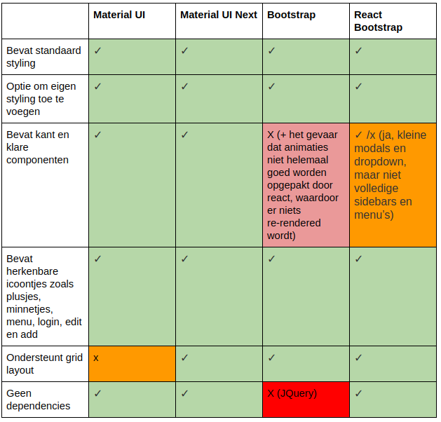

# Front-end boilerplate generator

## Onderzoeksmethode

**Categorie**: Library/Stepping Stones <br />
**Naam**: Design Pattern Search in combinatie met Comparison Chart

## Disclaimer
Er wordt vanuit gegaan dat de lezer van dit document bekend is met de context van het Burgers' Zoo Ranger project.

## Inleiding
Elk bedrijf wil tegenwoordig wel zijn eigen (web)applicatie hebben om de massa te bereiken, of om eigen content te beheren.
Deze applicaties kunnen op allerlei manieren en huisstijlen vormgegeven worden en er wordt altijd dezelfde eis gesteld:

_'De applicatie moet intuïtief zijn.'_

Dit onderzoek gaat over de zoektocht naar een design pattern voor de Burgers' Zoo Ranger- en Beheer applicaties, zodat deze
intuïtief zijn. De achterliggende gedachte is dat er eind december 2017 een field-trial gehouden wordt met echte gebruikers,
waarin de techniek achter deze applicaties getest wordt. Tijdens deze test moet zo veel mogelijk worden vermeden dat de
gebruikers uitleg nodig hebben over de werking van de applicatie.


**Doel**<br />
Ontwikkelaars van de applicatie moeten met zo min mogelijk development time een applicatie neerzetten die inuïtief is
voor de eindgebruiker. Het wiel hoeft echter niet opnieuw uitgevonden te worden, daarom wordt er gekeken naar wat de grote 
jongens bij Google, Facebook, Amazon en Apple al hebben bedacht. Het uiteindelijke doel is om een library te vinden die genoeg ondersteuning biedt bij het maken van een intuïtieve applicatie. Met 'genoeg' wordt bedoeld dat het aan een aantal opgestelde eisen voldoet die in de testopzet staan beschreven.

## Hypothese
Volgens [The Verge](https://www.theverge.com/2017/2/16/14634656/android-ios-market-share-blackberry-2016) runt 99,6% van
de nieuwe smartphones op Android of iOS, met Android aan de absolute top:

/cdn.vox-cdn.com/uploads/chorus_asset/file/7995033/Screen_Shot_2017_02_16_at_10.48.25_AM.png)

Android is van Google en Google heeft een library genaamd Material UI, die standaard webcomponenten bevat die Google zelf in
haar producten gebruikt. Denk aan Gmail, Google Drive, Youtube en vrijwel alle Android applicaties. Als de webapplicatie icoontjes, buttons en menu's bevat die iedereen al kent, wordt er in dit onderzoek van uitgegaan dat de applicatie intuïtief is. Omdat Android de marktwinnaar is, is de hypothese als volgt opgesteld:

_'Material UI is de meest geschikte library om in acht weken tijd twee intuïtieve webapplicaties neer te zetten.'_


## Testopzet

Er wordt een tabel gecreëerd (comparison chart) met over de verticale as eisen en over de horizontale as libraries.
Een library krijg een vinkje als het aan de eis voldoet en een kruisje als hij er niet aan voldoet. Het invullen van een
comparison chart gebeurt in een aantal stappen:

1. Er worden 3 alternatieven voor Material UI onderzocht.
2. Van elke library wordt gekeken hoeveel werk het de developer kost om het te gebruiken. Denk aan styling, grid support, kant en klare components en extra dependencies waar de library van afhankelijk is.
3. Kandidaat libraries worden gekozen op basis van duidelijke documentatie.
4. Voor de twee meest geschikte libraries wordt code geschreven om te testen hoe het werkt.

**voorwaarde**<br />
Er is één voorwaarde: de library moet werken met ReactJS.

## Kandidaat libraries
Om geschikte kandidaat libraries te vinden is er op Google gezocht naar "popular front-end libraries react 2017". 

- [Material UI, Google](http://www.material-ui.com/#/components/app-bar)
- [Material UI Next, Google](https://material-ui-next.com/getting-started/installation/)
- [Bootstrap, Twitter](https://getbootstrap.com/)
- [React Bootstrap, Twitter](https://react-bootstrap.github.io/introduction.html)

## Resultaat
In de onderstaande tabel staan de onderzoeksbevindingen in een comparison chart:



Met Material UI en Material UI Next is code geschreven om te kijken hoe je de applicatie in een grid layout kan zetten.

Material UI vereist dat je Flexbox gebruikt, zoals in [deze commit](https://github.com/HANICA-MinorMulti/nj2017-iot-dwa-BurgersZoo1/commit/5762c730f8aa41b135260c63a367ab04cd6c7887) te zien is:

```
    const styles = {
      appContainer: {
        display: 'flex',
        flexDirection: 'column'
      }
    };

    class App extends React.Component {
      render() {
        return (
          <div style={styles.appContainer}>
            <Layout />
            <MyRangerContainer />
          </div>
        );
      }
    }
```

Material UI Next levert <Grid /> componenten aan die je om je eigen componenten kan wrappen, zoals in [deze commit](https://github.com/HANICA-MinorMulti/nj2017-iot-dwa-BurgersZoo1/commit/243e166ddda33d73459cc4f3aec92f09db29d3b8) te zien is:

```
  import React, { Component } from 'react';
  import Grid from 'material-ui/Grid';

  import FactWidgetComponent from './fact-widget-component';
  import ParkOverviewComponent from './park-overview-component';
  import RangerVisitDate from './ranger-visit-date-component';

  class MyRangerComponent extends Component {
    render() {
      return (
        <div>
          <Grid container spacing={24}>
            <Grid item xs={12} sm={6}>
              <RangerVisitDate />
            </Grid>
            <Grid item xs={12} sm={6}>
              <FactWidgetComponent />
            </Grid>
            <Grid item xs={12}>
              <ParkOverviewComponent />
            </Grid>
          </Grid>
        </div>
      );
    }
  }

  export default MyRangerComponent;
```

## Conclusie

De hypothese 'Material UI is de meest geschikte library om in acht weken tijd twee intuïtieve websites neer te zetten.' is ontkracht. De meeste geschikte library is **Material UI Next**. De ontwikkeltijd geeft hierbij de doorslag.

Hoewel material UI qua design aan de verwachtingen voldoet, koste het toch meer dan een halve dag om Flexbox een beetje onder de knie te krijgen. Zowel React Bootstrap als Material UI Next leveren makkelijke componenten of classes aan om 
eenvoudig CSS attributen zoals respectievelijk 'xs' en 'col-span-xs' toe te voegen. Van deze twee valt React Bootstrap af, omdat de kant en klare componenten die meegeleverd worden beperkt zijn tot buttons, modals en dropdown menu's. Het kost dan uiteindelijk alsnog ontwikkeltijd om zelf je menu's en sidebars samen vorm te geven.
