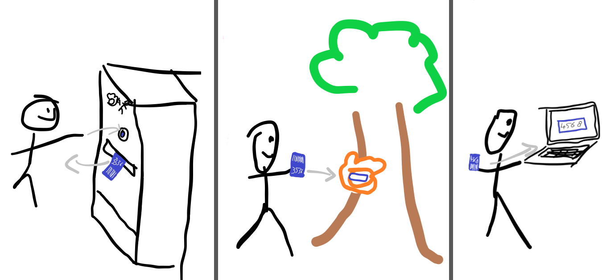

# Onderzoek NFC vs The World

In het begin van dit project is zonder discussie gekozen om NFC (officieel RFID, maar iedereen zecht NFC) pasjes te gebruiken om aan rangers te geven. In dit onderzoek wordt onderzocht of NFC wel echt de beste keuze was, of dat er misschien een andere keuze gemaakt had kunnen worden.

Met behulp van een Literature Study( en logisch nadenken is gezocht naar alternatieven. 

### NFC / RFID

### Barcode / QR
Een kartonnen pasje met een barcode kan ook worden gebruikt om aan kinderen mee te geven. Door middel van een barcode scanner kunnen de poten de pasjes van de kinderen scannen. Als gebruikt zou worden gemaakt van kartonnen kaartjes met een barcode, zou een machine ontwikkeld kunnen worden waar een kind zelf een rangerpas kan ontvangen. Deze machine zou lijken op een kaartautomaat bij een parkeergarage. Vervolgens kan de ranger met het geprintte kaartje langs de pootjes gaan. De poten scannen het kaartje met behulp van de barcode. Thuis kan de ranger op een website (die ook geprint is op het kaartje) de code van het kaartje intypen om te zien waar hij is geweest. Onderstaand een schets van hoe dit in zijn werk zou gaan:

 

Het grote voordeel van deze manier ten opzichte van een NFC pasje is dat de geprintte paartjes niet terug ingeleverd hoeven worden. Ook kan een kind het geprintte kaartje meenemen naar huis en de volgende keer weer meenemen naar het park. Hierdoor hoeft er geen printer aan het einde te zijn waar een kind een certificaat kan printen, en hoeft er bij een volgend bezoek geen certificaat ingescand te worden bij de kassa.

- Pasjes kunnen vies worden waardoor ze niet meer uit te lezen zijn.
+ De pasjes hoeven niet terug gegeven worden aan de dierentuin door de kinderen.
- Niet recyclebaar dus slechter voor het milleu.  
- sensor kan vies worden

### Magneetstrip