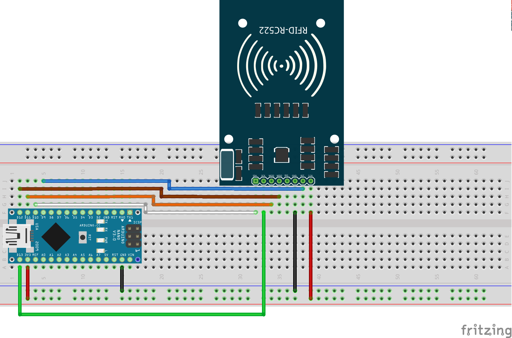
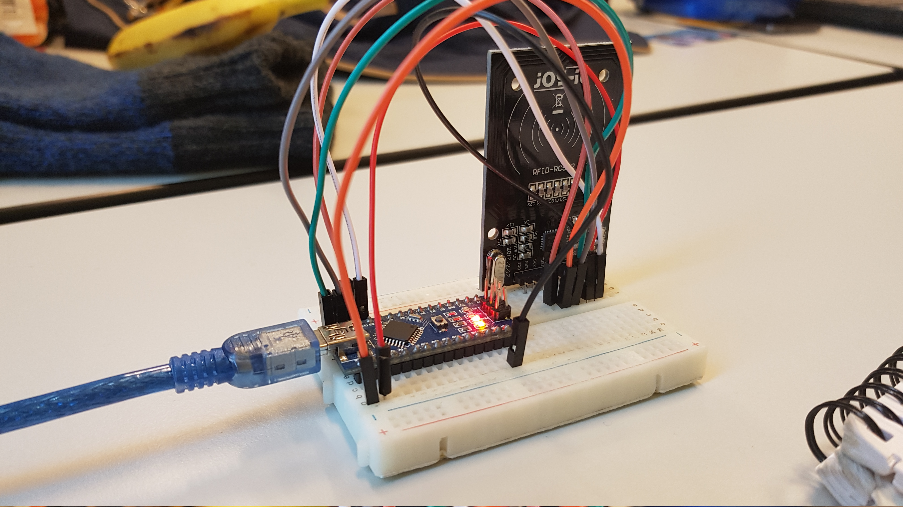

# NFC chips

## Onderzoeksmethode (uit de cmd methods pack)
Naam en categorie
> Proof of conecpt - workshop

## hypothese:  
Ik verwacht dat ik op een gemakkelijke manier de NFC kaarten een ID kan geven en op die manier verschillende kaarten van elkaar kan onderscheiden.

Ik wil twee dingen gaan onderzoeken:
- Het makkelijk uitlezen van identificatie code op de pas/druppel
- Hoe er geschreven kan worden naar een NFC pas/druppel

## Testopzet:
Om de twee vragen te kunnen beantwoorden is er een NFC lezer aangesloten op de Arduino Nano. Dit is gedaan volgens het Fritzing schema. 
Korte beschrijving van de manier van testen 

### Library
Om de NFC chip te kunnen uitlezen en schrijven is er een Library nodig die de functies van de lezer implementeerd. Hiervoor is de library gebruikt uit: [Arduino RFID Library for MFRC522](https://github.com/miguelbalboa/rfid).

***Code***
Bij het uitvoeren van de voorbeeldcode van de library (sketch Dumpinfo), komt de volgende output naar voren:

	Card UID: EE 4F AA 29
	Card SAK: 08
	PICC type: MIFARE 1KB
	
	Card UID: 3F CA B5 89
	Card SAK: 08
	PICC type: MIFARE 1KB
	
	Card UID: D8 68 A0 59
	Card SAK: 08
	PICC type: MIFARE 1KB
	
	Card UID: AF 03 B6 89
	Card SAK: 08
	PICC type: MIFARE 1KB
	
*Output is iets aangepast, de hexadecimale output is weggehaald tussen de passen/druppels in*

In deze output is goed te zien dat iedere kaart een eigen UID heeft. Deze lijkt uniek te zijn voor alle NFC passen en druppels die getest zijn.

### Testopstelling
Voor het testen van de het gebruik van de NFC kaart, doormiddel een Arduino Nano is gebruik gemaakt van het volgende Fritzign schema:

***Fritzing schema:***
 

***Foto opstelling:***
 

Deze opstelling is gebruikt voor beide tests. 

### Literatuur onderzoek
De RFID-RC522 werkt op 13.56 MHz (https://www.nxp.com/docs/en/data-sheet/MFRC522.pdf). De NFC kaarten die voor dit type RFID reader/writer te verkrijgen zijn op bijvoorbeeld Adafruit (https://www.adafruit.com/product/359) werken met 1 kilobyte intern EEPROM. Het geheugen dat in de kaart van Adafruit te vinden is kan meer dan 100.000x overschreven worden. Er is tevens een vast id van 4-bytes groot. Dit id kan gebruikt worden om NFC chips van elkaar te kunnen onderscheiden.

## Resultaat:

Tijdens dit onderzoek was het de bedoeling om antwoorden te krijgen op twee vragen:

- Het makkelijk uitlezen van identificatie code op de pas/druppel
- Hoe er geschreven kan worden naar een NFC pas/druppel

Om dit te doen is er een testopstelling gemaakt om de NFC chip uit te lezen en naar toe te schrijven. Het lijkt vrij makkelijk om de unique code op een pas uit te lezen. Deze code staat in het eerste blok op de pas/druppel.

Verder kan er ook op een vrij eenvoudige manier data naar de NFC chip geschreven worden doormiddel van functies uit de library. 
	
	MIFARE_Write(blockNr, &buffer, bufferSize);

Met de bovenstaande methode kan er naar een blok op de NFC chip geschreven worden. Er wordt dan een buffer meegegeven waarin zich bytes bevinden. De informatie wordt naar een intern EEPROM geschreven die een beperkt aantal keer overschreven kan worden. 

Een eventuele uitbereiding van het onderzoek zou kunnen naar de beveiliging van het NFC chip. Aangezien de kaart gemakkelijk uitgelezen kan worden en dus eventueel gekopieerd kan worden. 