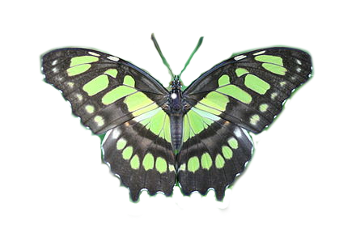
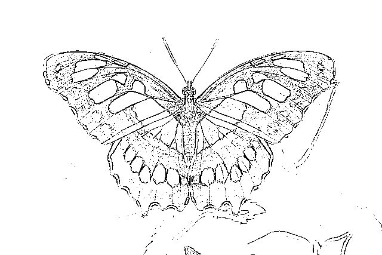
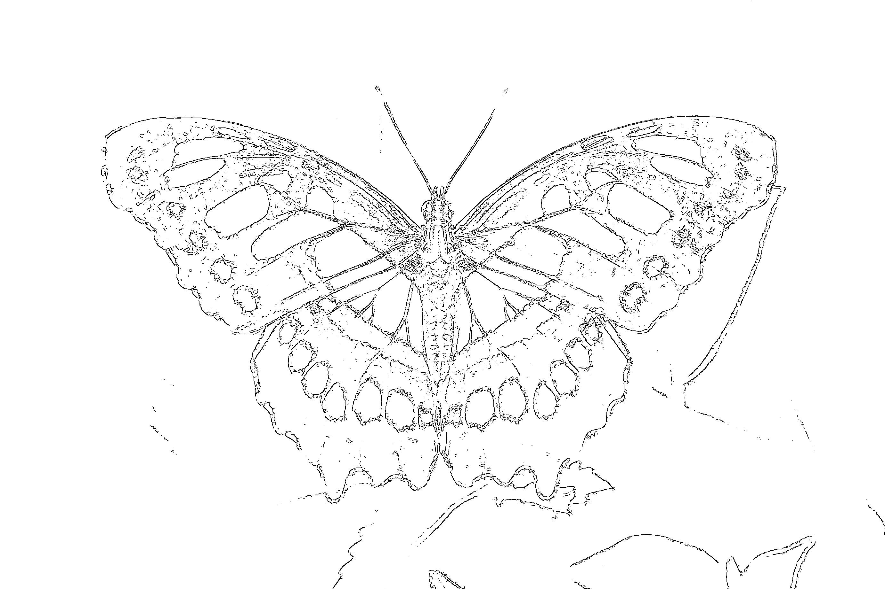
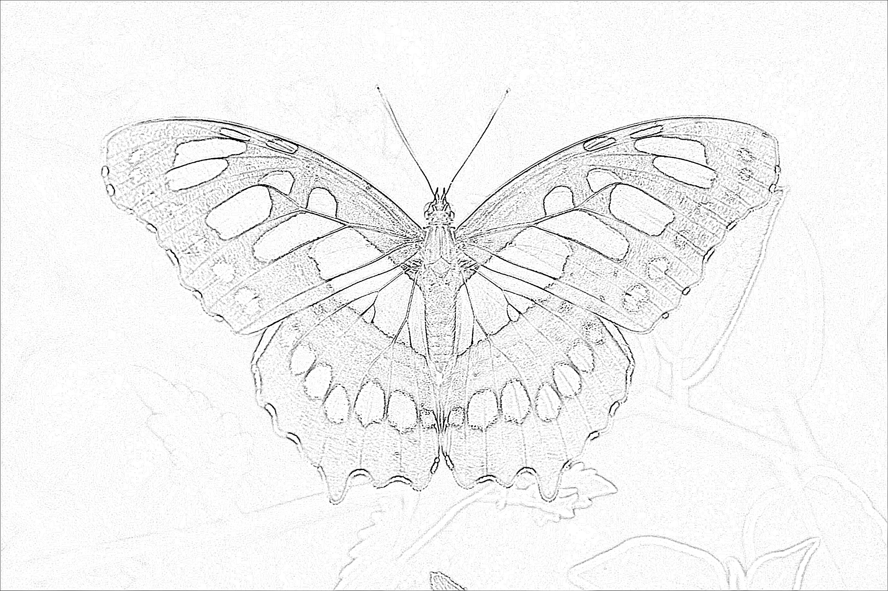

# Onderzoek Afbeelding op Plankje

In dit onderzoek is onderzocht hoe een afbeelding het beste kan worden weergegeven op een plakje. Het plan is om een vlinder afbeelding te laser-branden op een stuk hout. Dit is geïnspireerd naar de volgende sleutelhanger:

![images/voorbeeld.jpg]

Om een afbeelding op een stuk hout te branden is ten eerste een lijntekening nodig. Vervolgens moet deze lijntekening op hout gebrand worden. Hiervoor moet getest worden welk type hout en welke instellingen nodig zijn. 

## Stap 1: Afbeelding -> Lijntekening
In dit onderzoek wordt de volgende afbeelding gebruikt als voorbeeld:

Ten eerste is geprobeerd een handmatige overtrek te maken van de afbeelding gebruik makend van [Inkscape](https://inkscape.org). Dit proces kost veel tijd. Het onderstaande voorbeeld is de rechter vleugel van de vlinder en kostte 35 minuten om over te tekenen.   
  
Het resultaat heeft weinig detail en lijkt niet op de vleugel van de orginele foto. Deze manier van werken is dus niet geschikt.

Ook biedt inkscape de mogelijkheid om automatisch een overtrek te maken van een foto. Hieronder is een overtrek van de origineel foto met de standaard instellingen te zien.  
  
Te zien is dat de achtergrond ook wordt overgetrokken met grote donkere vlakken. De vlinder zelf heeft weinig detail. 

Om in volgende tests niet meer de achtergrond mee te nemen in het overtrekproces is met [Paint.NET](https://www.getpaint.net/) een transparante variant gemaakt van de vlinder foto. Het resultaat is als volgt:
  

Vervolgens zijn met verschillende overtrektools deze transparante vlinderafbeelding overgetrokken. Hieronder zijn de resultaten te zien.

**Overtrek met Inkscape Kleurdetectie**  

**Overtrek met Inkscape Randdetectie**  

**Overtrek met [photo-kako.com](photo-kako.com) pen tool**  

**Overtrek met [snaptouch.com](snaptouch.com) outline tool**  

**Overtrek met [snaptouch.com](snaptouch.com) pencil sketch tool**  

Om tot een keuze te komen welke overtrek gebruikt gaat worden om te testen op de laserbrander is een Showroom Expo gestart. De vijf bovenstaande overtrekken zijn laten zien aan een groep testers met de vraag welke ze het mooiste vinden. De resultaten zijn als volgt:

| Type lijntekening                                        | Aantal stemmen voor 'mooiste' |
| -------------------------------------------------------- | ----------------------------- |
| Overtrek automatisch met Inkscape Kleurdetectie          | 0                             |
| Overtrek automatisch met Inkscape Randdetectie           | 2                             |
| Overtrek automatisch met photo-kako.com pen tool         | 0                             |
| Overtrek automatisch snaptouch.com outline tool          | 0                             |
| Overtrek automatisch snaptouch.com pencil sketch tool    | 2                             |
| Automatische overtrek met Inkscape inclusief achtergrond | 0                             |

De conclusie is dat de overtrek gegenereerd met Inscape gebruik makend van Kleurdetectie én de overtrek gegenereerd met Snaptouch.com gebruik mandend van de Pencil Sketch Tool beide getst gaan worden op de laser printer.

## Stap 2: Lijntekening -> Hout
In deze stap wordt de lijntekeningen zoals gekozen in stap 1 gebrand met de laserprinter op hout om te testen welk hout en instellingen gebruikt moeten worden met de laserprinter.  

DIT GEDEETLE VAN DIT ONDERZOEK KOMT LATER.