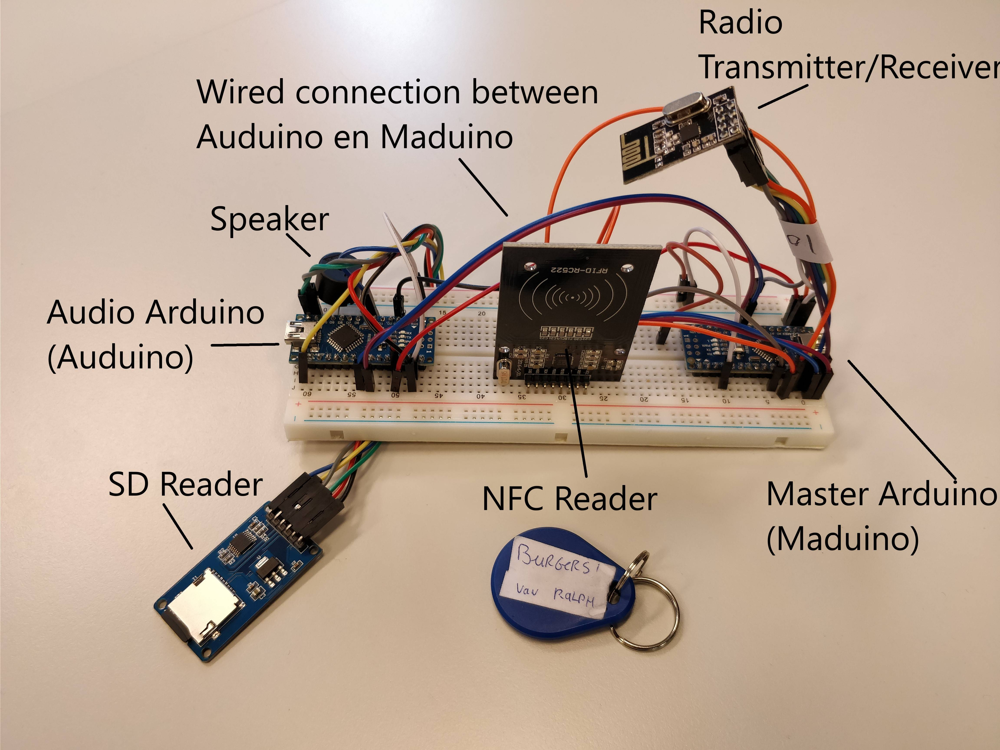

# Poot Code Quality

In de afgelopen weken heb is gewerkt aan een de herstructurering van de code voor de poot. De code vóór deze herstructurering was moeilijk te begrijpen en kon niet uitgebeid worden. Door een klassediagram op te stellen, en vervolgens de code te refactoren is geprobeerd de code overzichtelijk, onderhoudbaar en uitbreidbaar te maken. 

In dit onderzoekje wordt onderzocht of de code kwaliteit goed genoeg is om door nieuwe programmeurs te snappen. Dit is belangrijk omdat toekomstigge ontwikkelaars (bijvoorbeeld in een volgend project) de code moeten kunnen snappen om aan de code te kunnen ontwikkelen.

## Testopzet
In dit onderzoek wordt gebruik gemaakt van *field trail: participant observation* en *showroom: peer review*. Het plan is om [de code van de poot](https://github.com/HANICA-MinorMulti/nj2017-iot-dwa-BurgersZoo1/pull/91) voor een programmeur neer te zetten die nog nooit de code heeft gezien. Vervolgens zullen een aantal opdrachten worden gegeven die een beeld geven of de testpersoon de code kan begrijpen. Om context bij de code te geven zal de volgende afbeelding getoond worden bij de code.

De opdrachten voor de testpersonen zijn als volgt:
1. Loop door de code heen van Maduino en leg uit wat deze doet.
2. Wijs aan waar je code moet toevoegen om een actie te doen wanneer een pas gescand wordt.
3. Leg uit wat er in `rangerdetector.cpp` gebeurt.

Met deze vragen worden alle structuren in de codebase bezocht en wordt getest of de opbouw van code begrijpelijk is voor nieuwe ontwikkelaars.

## Hypothese
Ik verwacht dat de code 100% te begrijpen is. Alles is netjes opgedeeld of uitgelegd met comments, en daarmee zou de code voorzichzelf sprekend moeten zijn. 

## Testpersonen

Er is getest met twee testpersonen. Beide testpersonen hebben vantevoren nog nooit de code gezien. 

Testpersoon A is een student software ontwikkeling zonder ervaring met C++. Deze pesoon zal voor begrip dus instinctief vertrouwen op code-structuur in plaats van de exacte syntax. Ook kent Testpersoon A de details van de opdracht van dit project niet. 

Testpersoon B zit in de projectgroep van burgerszoo, heef wél ervaring met C++, maar heeft nog nooit iets van de poot-code gezien. Bij deze testpersoon is het interesant om te zien of de verwachtingen geschept uit de rest van project overeen komen met de code voor de poot.

## Testresultaten
Beide testpersonen konden zonder aanwijzingen de opdrachten uitvoeren. Wel waren er een heel aantal kleine onduidelijkheden;

* **Wat betekent `TMRpcm`?** (in `audio.cpp`) Dit is de naam van de library die gebruikt wordt om audio af te spelen.
* **Wat betekent `SD.begin(4)`** (in `audio.cpp`) Dit is de initializatie van de sd-kaart. 
* **"Hier speelt hij het 'abc' geluidje af."** Wijzend naar de code `abc->play()`. Dit klopt niet. In dit geval was `abc` een instantie van `Audio`. 
* **"`RangerDetector::loop` is veelstelang om makkelijk te kunnen zien."**. De reden voor deze lange functie is omdat er anders een heel aantal variable doorgegeven moeten worden of globale variable moeten zijn. 

## Conclusie
De conclusie van dit onderzoekje is dat de code voldoende te begrijpen is om te kunnen begrijpen door mensen die niet de code kennen. Toch kunnen er nog puntjes beter. Onderstaande punten zijn verbeterd na aanleiding van dit onderzoek:

* Uitleg geven over de verschillende libraries zodat de namen in de code te begrijpen zijn. 
* Binnen de Auduino de klasse `Audio` hernoemen naar `AudioPlayer`. Ook de variable met instanties deze naam geven. Zo wordt duidelijk dat de `Audio` niet één audio bestand voorstelt, maar dat het de audiospeler is.
* Magic numbers vervangen door constant variable.
* De `RangerDetector::loop` opsplitsen in meerdere methodes.

