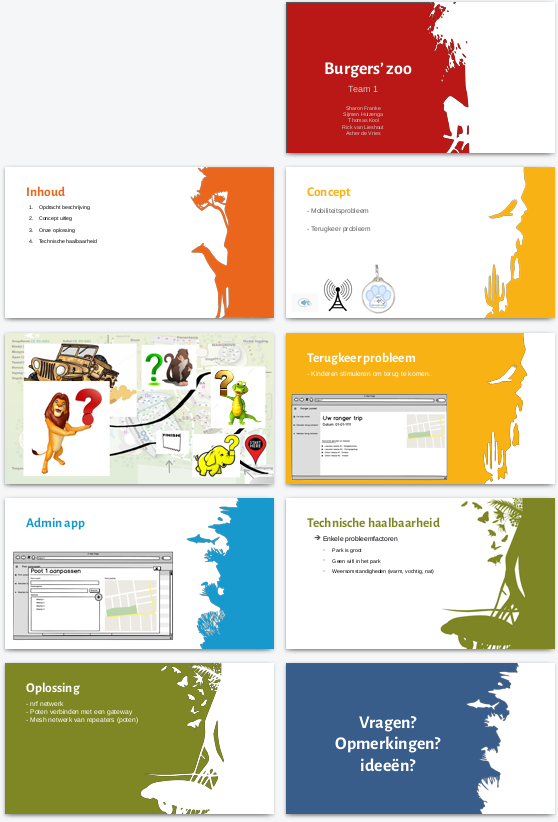

## Onderzoek 2 - Storytelling

## Onderzoeksmethode

**Categorie**: Workshop  
**Naam**: Storytelling

## Hypothese

Ik verwacht de andere groepen / geinteresseerde te informeren over onze opdracht, de voortgang daarin en de ondervonden resultaten. Daarnaast verwacht ik dat er na de presentatie andere groepen belangstelling gaan tonen en ons daarmee andere inzichten verschaften.

## Test opzet

Om de mensen zo goed mogelijk te informeren is het belangrijk dat ze duidelijk krijgen wat voor opdracht er uitgevoerd wordt.
Om de opdracht in te leiden zal er een korte presentatie gehouden worden over de opdracht en de daarbij opgestelde doelen. De presentatie zal informeel gebeuren en meer dienen als visuele ondersteuning dan als leidraad.

Aan het einde zal er enthousiast gevraagd worden of de andere groepen ideen / opmerkingen hebben die ons verder kunnen helpen.

De presentatie: [presentatie.pptx](./tussenpresentatie.pptx)

De presentatie als foto's:

## Resultaat

Het resultaat kan ik pas maandag meten.
Voorbereiden is essentieel.

## Conclusie
Deze komt volgende week

## bronnen
