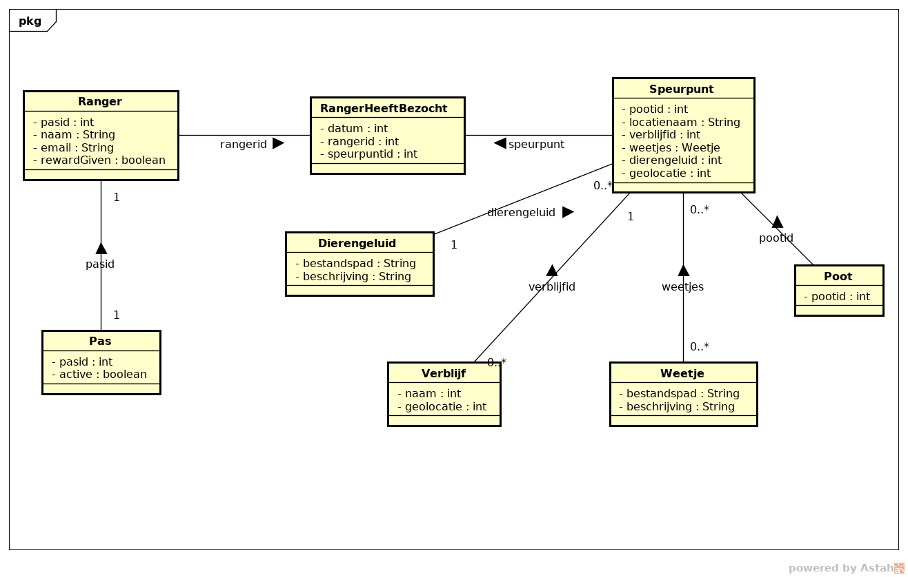

# Data Opslag
Om de data van het systeem op te slaan wordt er een Mongo database gebruikt. Deze database wordt gevuld door Loopback. Loopback werkt iets anders dan Mongo met data omdat het een model systeem gebruikt.

In Loopback genereer je models met eigenschappen. Deze eigenschappen staan gelijk aan de keys uit de key-value pairs in een document in Mongo. Elk model staat ook gelijk aan een collection in Mongo. Als je een relatie maakt tussen twee modellen wordt dit door middel van links of embedded documents, afhankelijk van de relatie, verwerkt in Mongo.

Een globale weergave van de data in de database is hieronder te zien. Dit bevat alleen de data van de twee webapplicaties, nog niet de data die de gateway nodig heeft.

Een ranger kan met zijn pas mee doen aan de speurtocht. De locaties die een ranger bezocht heeft zijn te vinden in 'ranger heeft bezocht'.
De plekken die een ranger bezoekt zijn Speurpunten. Die staan in een verblijf. Weetjes en een dierengeluid worden op het speurpunt geladen zodat deze afgespeeld kunnen worden voor de rangers. Uiteindelijk wordt een speurpunt op een fysieke poot geladen zodat hij klaar is voor gebruik.

Vanuit de API specificatie die gemaakt is voor de gateway komt er nog een andere databehoefte naar boven. Beide dataschema's samen zijn verwerkt in de API, dat levert onderstaand dataschama op. Hierin zijn de relaties tussen de verschillende modellen te zien.

