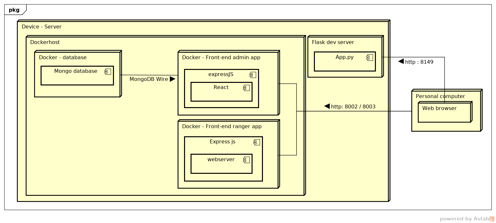

# deployment

Voor dit project zal er gewerkt worden met twee deployment strategieën, dit wordt gedaan omdat de deployment tijdens het testen minder secure hoeft te zijn dan tijdens echte productie. Het doel is om de productie build online te hebben bij de field-tests.

## Beide versies
Beide versies draaien op een black-box server waar [Docker](https://www.docker.com/) containers gedraaid kunnen worden (al dan niet met [docker-compose](https://docs.docker.com/compose/)). Voor zowel de development deployments als de productie deployments wordt docker gebruikt.

## Development versie

In de development deployment worden de softwareproducten gedraaid met hun built-in development servers. (bijv. npm start -> dev react app)

Dit staat ons toe om snel te schakelen tussen de verschillende producten aangezien er niks gebuild hoeft te worden.

## Productie versie

