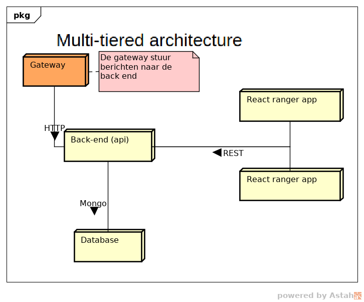

De architectuur m.b.t hetgeen buiten de poten om draait ziet er als volgt uit:

## Multi-tiered
Bij de ontwikkeling van de architectuur is rekening gehouden met het feit dat we een prototype ontwerpen, omdat de producten in dit prototype vaak kunnen veranderen is het verstandig om te kijken naar een modulaire architectuur. Hierin is gekozen voor een "multi-tiered" aanpak. Dit wil, in het kort, zeggen dat er verschillende "lagen" worden gemaakt die ieder verantwoordelijk zijn voor één aspect van het systeem.

De verschillende "lagen" worden in de volgende hoofdstukken uitgelegd.

## Database
De database laag zal enkel en alleen de database bevatten, op het moment van prototyping is dit één Mongo database. Dit kan echter uitgebreid worden met meerdere instances (voor redundancy, uitbreidbaarheid) en eventueel voorzien worden van een load balancer.

Al deze dingen samen maken de "data" laag, hét centrale punt om data op te halen met de rest van de applicaties.

## back-end
Het back-end betreft een REST api welke aangesproken zal worden met de verschillende front-ends. De REST api zelf spreekt de datalaag aan om zijn data op te slaan en op te halen. Deze laag kan wederom uitgebreid worden met meerdere back-ends / load balancers.

## front-end apps

De front-end apps zijn modulair opgezet, deze apps draaien op hun eigen plekje en roepen het REST backend middels HTTP aan. Als zei data willen manipuleren zal dit dus ook via de back-end moeten verlopen.

Alle front-end apps bij elkaar worden gezien als de "front-end laag", zelfs als deze op andere fysieke machines draaien. Het los koppelen van de applicaties bevordert de werkbaarheid en stabiliteit van de architectuur. Elke app kan afzonderlijk gedeployed / getest worden zonder de rest van de architectuur te beinvloeden.
