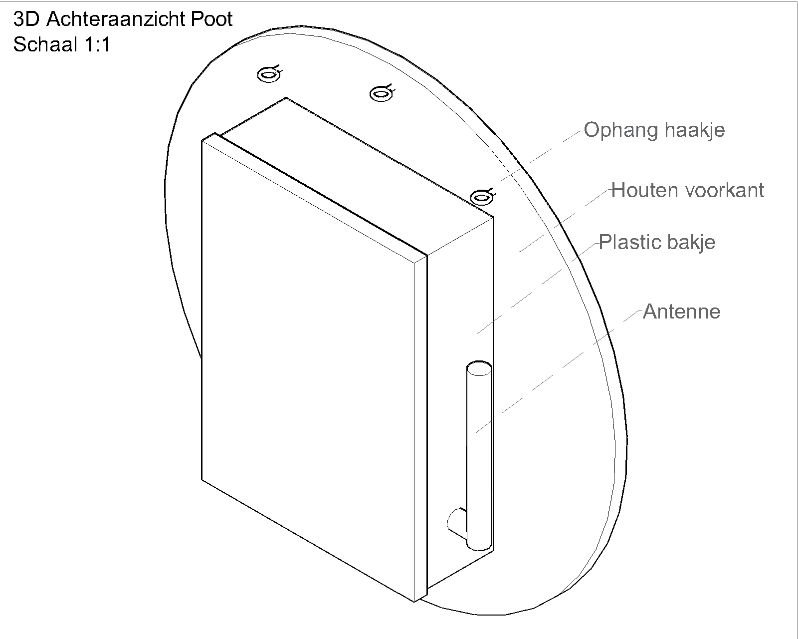
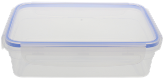
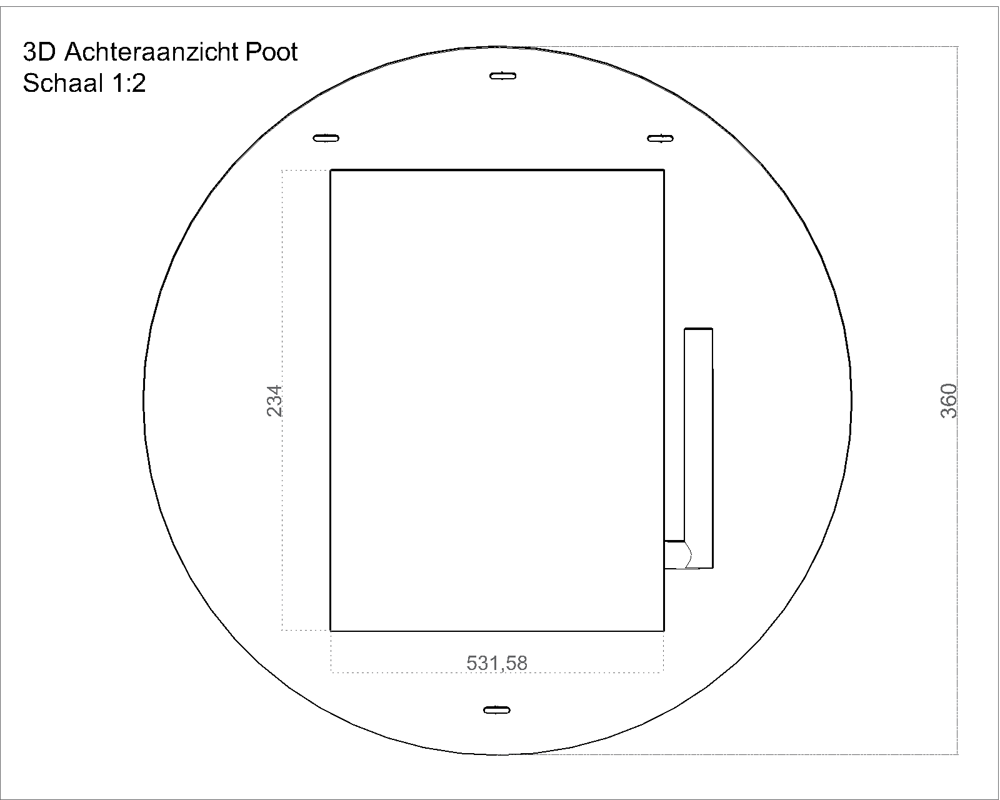
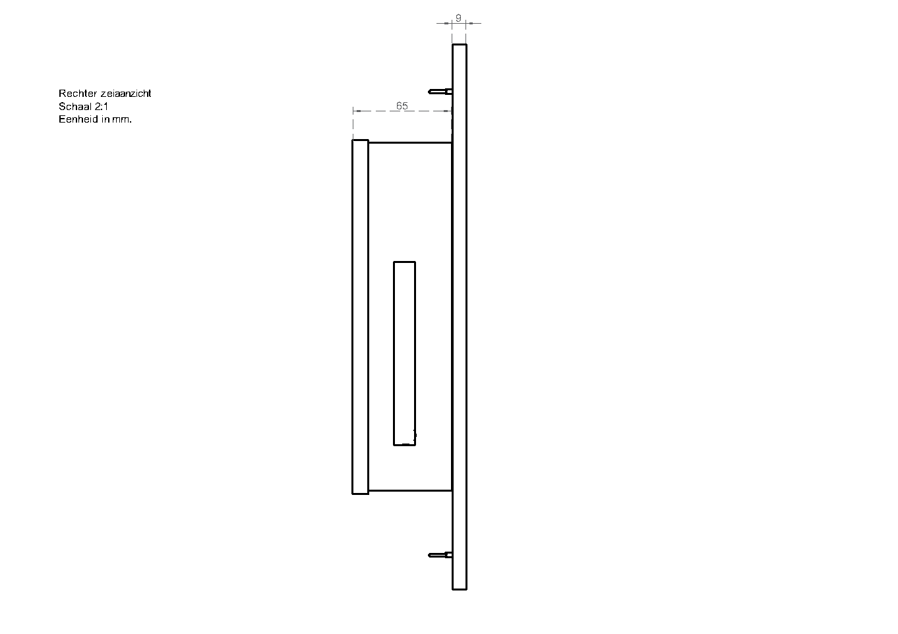

# Fysiek ontwerp poot
De fysieke poot zal gebouwd worden naar onderstaand ontwerp.

De techniek van de poot wordt beschermd door een [plastic bakje](https://www.action.com/nl-nl/p/excellent-houseware-bewaartrommel/) van de action. Dit bakje ziet er als volgt uit:

De voorkant van de poot bestaat uit hardhout multiplex zoals is geconcludeerd uit [dit](https://github.com/HANICA-MinorMulti/nj2017-iot-dwa-BurgersZoo1/blob/master/documentatie/onderzoeken/poot-behuizing-materiaal/poot-behuizing-materiaal.md) onderzoek. De houten voorkant wordt gelijmd op de onderkant van het plastic bakje. Om de poot te kunnen ophangen tijdens de live tests worden twee haakjes bevestigd aan de voorplaat. 

Op de houten voorplaat zal een vlinder worden [gebrand](https://www.youtube.com/watch?v=B1A19DLW7PM). Hoe dit in zijn werk zal gaan is te lezen in [dit](https://github.com/HANICA-MinorMulti/nj2017-iot-dwa-BurgersZoo1/blob/master/documentatie/onderzoeken/poot-afbeelding-naar-plankje) onderzoek.

Onderstaande technische tekeningen laten de dimenties van de poot zien.

Achteraanzicht:  

Rechter zijaanzicht:  

Een pdf variant van deze technische tekeningen zijn [hier](TODOhttps://github.com/HANICA-MinorMulti/nj2017-iot-dwa-BurgersZoo1/blob/master/documentatie/onderzoeken/poot-afbeelding-naar-plankje) te vinden. De orginele AutoCAD ontwerpen zijn [hier](TODO) te downloaden.