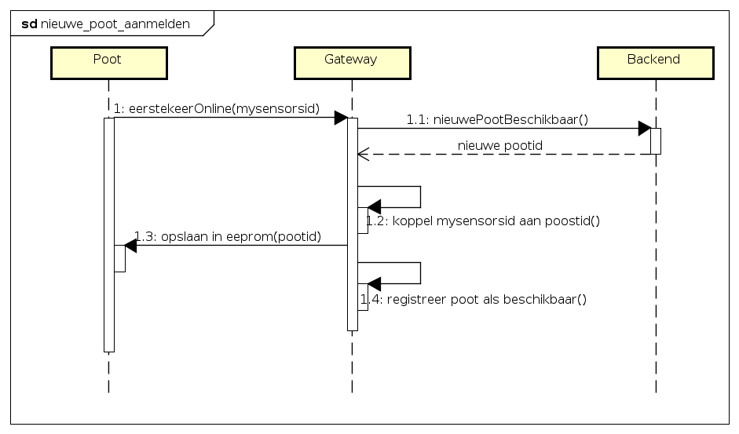
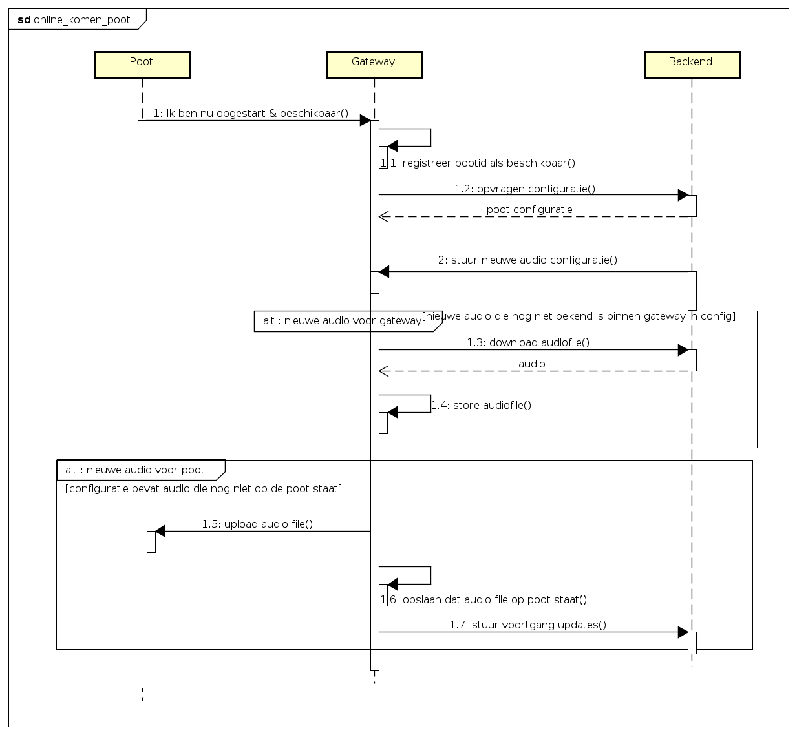
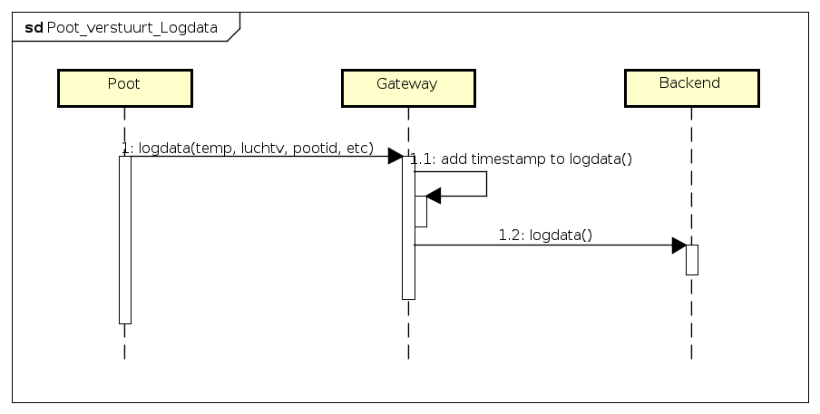
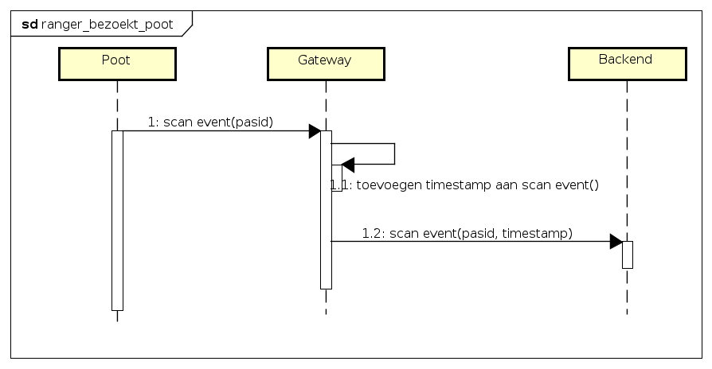

# System flow

## Nieuwe poot aanmelden

Wanneer een totaal nieuwe poot in het systeem komt, moet deze aangemdeld worden binnen het systeem. Dit sequence diagram beschrijft de gebeurtenissen bij het aanmelden van een nieuwe poot. Deze poot heeft nog geen configuraties. De bedoeling is dat de poot een ID krijgt van de backend waarmee de poot identificeerbaar is.

## Online komen poot

Wanneer een poot uit heeft gestaan en weer online komt (bijvoorbeeld voor onderhoud of bij stroomuitval), zal deze een opstart sequence doorlopen. Wanneer een poot voor het eerst wordt opgestart zal de sequence diagram voor "*Nieuwe poot aanmelden*" doorlopen worden.

Na het aanmelden bij de gateway zal de gateway aan de backend vragen naar de configuratie van de poot. De backend zal de configuratie terug sturen naar de gateway. Wanneer de confiuratie van de poot gelijk is gebleven zal de gateway geen actie ondernemen. Anders zal de gateway de audio bestanden downloaden en lokaal opslaan zodat deze later niet gedownload hoeft te worden.

De audio bestanden die nog niet op de poot voorkomen zullen dan verzonden worden naar de poot en op de gateway wordt bijgewerkt welke audo files op de poot staan. Gedurende het verzenden van de audio files zal de gateway ook updates naar de backend sturen om de voortgang te melden.

## Poot versturen logdata

De poot verstuurt periodiek logdata naar de gateway. De gateway zal een timestamp toevoegen en een JSON object opbouwen. De timestap wordt bij de gateway toegevoegd sinds de poot geen besef van tijd heeft. Dit object wordt doorgestuurd naar de backend. Onder logdata valt ook informatie over dat een ranger de poot heeft bezocht.

## Ranger bezoekt poot
Link naar use case: [Link naar use case](https://github.com/HANICA-MinorMulti/nj2017-iot-dwa-BurgersZoo1/blob/docs/documentatie/use%20cases/pas%20scannen/pas%20scannen.md)

Wanneer een ranger een poot bezoekt scant de ranger de NFC kaart. De poot verstuurt het id dat op de pas staat door naar de gateway. De gateway voegt een timestamp toe aan het het scannen van de kaart en stuurt dit door naar de backend.

