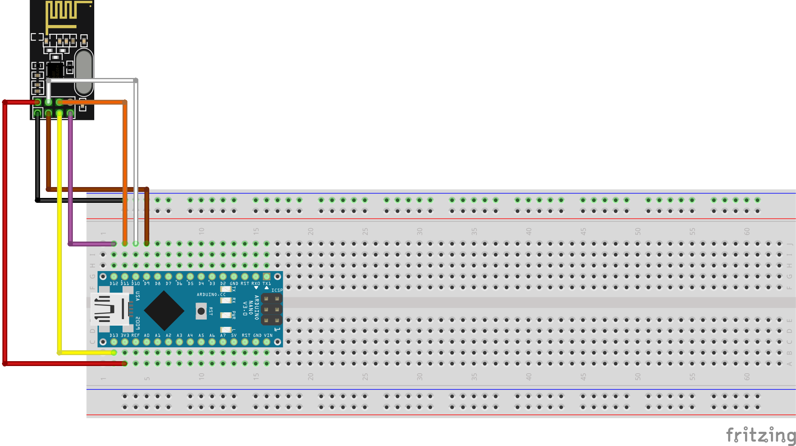

# Gateway

De gateway is verantwoordelijk voor het ontvangen van alle binnenkomende berichten uit het [MySensor netwerk](https://www.mysensors.org/) en het versturen van nieuwe berichten naar poten. Ook is de gateway verantwoordelijk voor het koppelen van de node id's uit het mesh netwerk met de poot id's die die backend gebruikt.

#### Onderdelen gateway
- 1 Raspberry Pi 3
- 1 microSD kaart
- 1 Arduino Nano
- NRF24L01+

De besissingen voor de taal en framework die op de gateway draaien is te vinden in het [besissingen document](../../../groepsprocess/Beslissingen.md).

#### Aansluitschema
Het aansluitschema voor de Nano is hieronder te vinden, deze verbind vervolgens via een USB kabel met de Raspberry Pi 3.

Om de Raspberry Pi 3 te installeren kan de [installatie handleiding](../../opleverings-documentatie/installatie-handleiding-gateway.md) gevolgd worden.