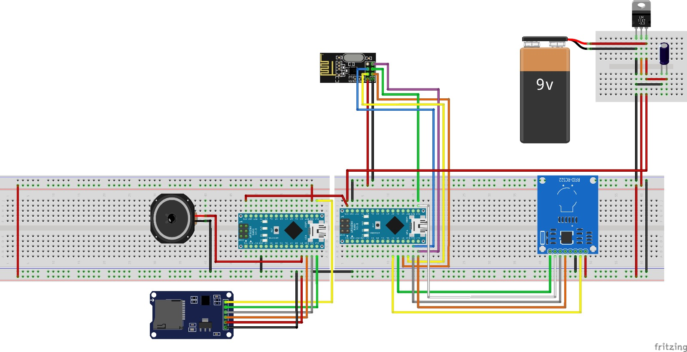

# Poot

De poot is het punt waar kinderen hun passen kunnen gaan scannen. Door ontbreken van bestaande netwerk infrastructuur hebben wij de keuze gemaakt om zelf een zelfhelend mesh netwerk op te zetten doormiddel van NRF24L01+ chips icm de [MySensor library](https://www.mysensors.org/). 

De passen die gescand worden hebben een NFC chip, waarbij het unike id van deze kaart dient als identificatie nummer. Dit nummer wordt daarna verzonden via het mesh netwerk naar de backend.

#### Onderdelen poot
- 2 Arduino Nano's
- NRF24L01+
- SD/Micro SD kaart lezer
- RFID lezer
- Speaker via 3.5 mm jack
- Vorm van voeding (voor het prototype)
- Capacitor
- Voltage Regulator

Er is gekozen voor twee verschillende Arduino Nano's omdat er anders problemen onstaan met het afspelen van audio en ontvangen/versturen van data via de NRF24L01+. Deze twee chips maken allebei gebruik van de SPI bus en kunnen dus niet tegelijkertijd worden aangesproken. Om dit op te lossen zijn de Arduino's in een master/slave opstelling. Er is dan één Arduino verantwoordelijk voor de aansturing, ontvangen/versturen van berichten en uitlezen van RFID lezer. Deze arduino heet de Maduino. De andere Arduino Nano (genaamde de Auduino) is verantwoordelijk voor het uitlezen van de SD/Micro SD kaart en het ontvangen van commando's van de master.

#### Aansluitschema
Deze communiceren met elkaar via I2C. Er is gekozen voor I2 en niet voor bijvoorbeeld de seriële poort omdat we tijdens het prototypen nog gemakkelijk de Arduino's kunnen debuggen.

#### Initialisatiesequentie
Wanneer de maduino opstart worden de volgende acties gedaan:
1. Pinnen RFID uitschakelen
2. MySensors initialisatie inculsief NRF initialisatie. (deze stap halt het initializatieproces totdat er verbinding is met de gateway)
3. RFID initialisatie
4. Connectie naar auduino initialiseren.

Dit betekent dat er pas passen gescand kunnen worden wanneer de poot verbinding heeft met de gateway. Dit is niet gewenst sinds nu alle poten stoppen met werken wanneer de gateway offline gaat. Helaas is dit niet op te lossen omdat de MySensors initialisatie alleen werkt wanneer de pinnen naar de RFID sensor die óók op SPI zit helemaal uit staan. Wanneer éérst de RFID wordt ingeschakeld moet daarna de pinnen naar die RFID weer uitgezet worden, waardoor de initialisatie van de RFID ongedaan wordt. Het is niet gelukt een andere manier van initialisatie te vinen die dit probleem oplost. 

